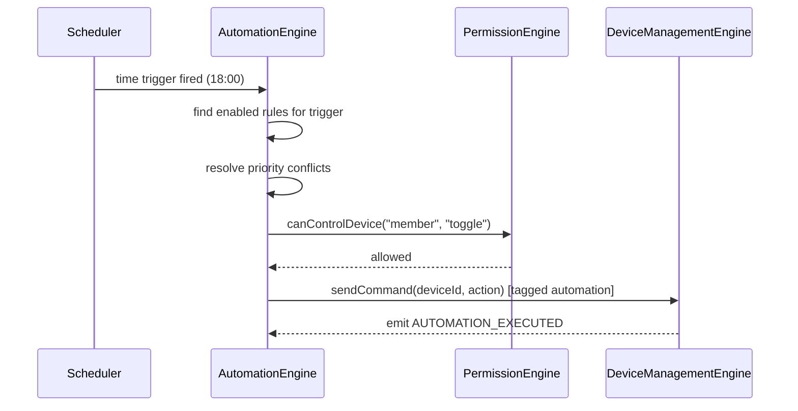
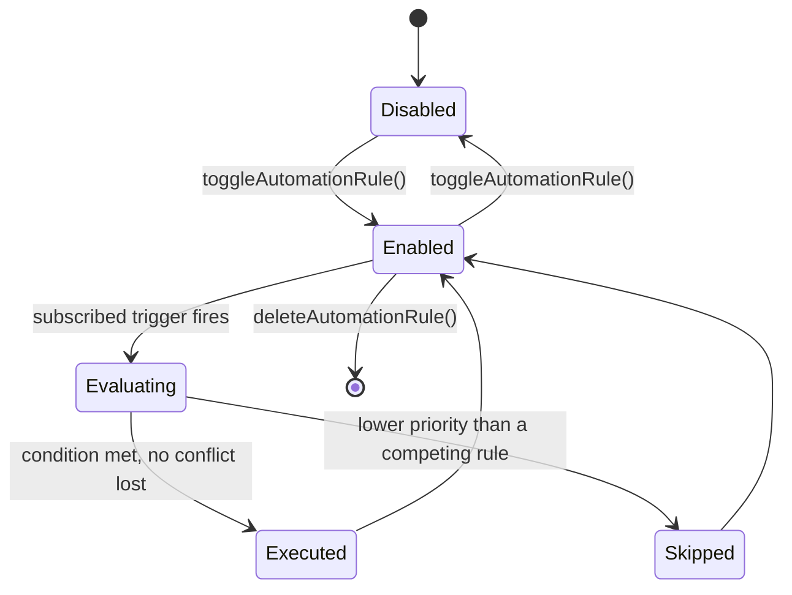

# Automation Engine

## 1. Purpose

The Automation Engine evaluates "when X happens, do Y" rules so devices can
react to conditions without the user manually operating them each time —
time-of-day triggers, sensor-driven triggers, and scene composition.

**Status**: implemented as UI-layer state only. `context/LumaContext.tsx`
holds `lampAutomations: Record<string, AutomationRule[]>` with
`toggleAutomationRule`/`deleteAutomationRule`/`addAutomationRule`, and
`AutomationRule` (`data/luma-data.ts`) is a flat `{ id, name, trigger,
action, enabled, priority }` shape with `trigger`/`action` as free-form
strings — there is no evaluation loop that actually watches triggers and
fires actions today; rules are stored and toggleable but not executed.
This document specifies the Automation Engine that would own real
evaluation, extracted out of the UI layer into the gateway architecture.

## 2. Responsibilities

- Store automation rules per device (and, in the future, per scene/room)
  with a structured trigger/condition/action shape rather than free-form
  strings.
- Evaluate triggers as they occur (time reached, device state changed,
  schedule fired) and execute the corresponding action through the
  [Device Management Engine](DeviceManagementEngine.md).
- Respect rule priority when multiple rules could fire from the same event,
  and respect each rule's `enabled` flag.
- Avoid feedback loops: an automation-triggered device change must not
  itself re-trigger the same rule (or an opposing one) in an infinite
  cycle.

## 3. Features

- Per-device rule list, toggle/delete/add already implemented at the UI
  data layer (`LumaContext`).
- Priority field on every rule (`AutomationRule.priority`) — spec target:
  used by the evaluator to pick a winner when two enabled rules would both
  fire for the same trigger with conflicting actions.
- Trigger types (spec target, generalizing today's free-form `trigger`
  string): `time` (fixed time or sunrise/sunset offset), `device_state`
  (another device crossing a threshold/state), `schedule_fired`
  (delegating to [DeviceManagementEngine.md](DeviceManagementEngine.md)'s
  per-device schedules for simple timers, with Automation handling
  everything conditional beyond that).
- Loop guard: a rule execution tags its resulting command as
  "automation-originated" so the evaluator can ignore it as a fresh trigger
  source for the same rule.

## 4. Workflow

1. **Rule authoring**: user adds/edits a rule via UI, calling
   `addAutomationRule(lampId, rule)`; the rule is stored disabled or
   enabled based on user choice.
2. **Trigger registration**: on `start()`, the evaluator subscribes to the
   relevant event sources for every enabled rule — device state changes via
   [Device Management Engine](DeviceManagementEngine.md), time ticks via an
   internal scheduler.
3. **Evaluation**: when a subscribed event occurs, the evaluator checks
   every enabled rule referencing that trigger source; if the rule's
   condition is satisfied, its action is queued for execution.
4. **Conflict resolution**: if multiple triggered rules target the same
   device in the same evaluation pass, the highest-`priority` rule wins;
   others are skipped and logged (not silently dropped) so the user can see
   why a lower-priority rule didn't apply.
5. **Execution**: the winning action is dispatched through
   [Device Management Engine](DeviceManagementEngine.md)'s `sendCommand`,
   tagged as automation-originated.
6. **Loop guard check**: before evaluating a `device_state` trigger, the
   evaluator checks whether the state change was itself automation-
   originated from the *same* rule; if so, it's ignored for that rule only
   (other rules can still react normally).

## 5. Internal Components

| Component | Responsibility |
|---|---|
| `RuleStore` (spec target, currently `LumaContext` state) | Per-device rule persistence |
| `TriggerSubscriptionManager` | Subscribes to the right event sources per enabled rule |
| `RuleEvaluator` | Checks conditions, resolves priority conflicts |
| `LoopGuard` | Prevents automation-originated changes from re-triggering their own rule |

## 6. Public APIs

### `addAutomationRule(lampId: string, rule: AutomationRule): void`
Adds a rule (existing `LumaContext` method).

### `toggleAutomationRule(lampId: string, ruleId: string): void` / `deleteAutomationRule(lampId: string, ruleId: string): void`
Enable/disable or remove a rule (existing methods).

### `evaluateNow(lampId: string): Promise<void>` (spec target)
Forces an immediate evaluation pass for a device's rules, useful right
after a rule is added/edited so the user sees an effect without waiting
for the next natural trigger.

### `getActiveRules(lampId: string): AutomationRule[]` (spec target)
Returns only currently-enabled rules for a device.

## 7. Events

| Event | Payload | Emitted when |
|---|---|---|
| `AUTOMATION_RULE_ADDED` / `AUTOMATION_RULE_DELETED` | `{ lampId, ruleId }` | Rule list changes |
| `AUTOMATION_RULE_TOGGLED` | `{ lampId, ruleId, enabled }` | Rule enabled/disabled |
| `AUTOMATION_TRIGGERED` | `{ lampId, ruleId, trigger }` | A rule's condition is satisfied |
| `AUTOMATION_CONFLICT_RESOLVED` | `{ lampId, winningRuleId, skippedRuleIds }` | Multiple rules competed for the same device |
| `AUTOMATION_EXECUTED` | `{ lampId, ruleId, action }` | The winning action was dispatched |

## 8. Database Schema

Via the [Database Engine](DatabaseEngine.md): `automation_rules` (id,
deviceId, name, trigger JSON, condition JSON, action JSON, enabled,
priority). Not persisted today — rules live only in `LumaContext`'s
in-memory state and reset on app restart.

## 9. Local Storage

None today. Spec target: persist rules so they survive app restarts and
keep evaluating without requiring the app to have been freshly configured
each session.

## 10. Communication Interfaces

- **Internal**: [Device Management Engine](DeviceManagementEngine.md)
  (trigger source + action execution target), [Event Engine](EventEngine.md)
  (trigger event subscriptions), [Notification Engine](NotificationEngine.md)
  (surfacing conflict resolutions / execution failures).
- **External**: none — all evaluation is local to the phone today; a future
  version might move evaluation to always-on hardware (the ESP32 itself, or
  a backend scheduler) for reliability when the phone is off, which this
  document intentionally does not claim already exists.

## 11. Security

- Automation-triggered commands go through the same
  [Permission Engine](PermissionEngine.md) gating as any manual command —
  a rule cannot bypass role restrictions (an automation "runs as" the
  household's automation identity, which the spec assigns `member`-level
  permissions by default, not `owner`).
- Rule authoring itself should be restricted to `member` and above (not
  `guest`), consistent with the existing `schedule_write` permission
  entry's role scope.

## 12. Error Handling

- Action dispatch failure (device unreachable) → the rule is not marked
  failed permanently; it simply didn't execute this time and will be
  re-evaluated on the next matching trigger.
- Two enabled rules with identical priority targeting the same device →
  spec target: earliest-created rule wins as a deterministic tiebreaker,
  and this fact is surfaced via `AUTOMATION_CONFLICT_RESOLVED` so it's
  never a silent coin flip.
- Malformed rule definition (missing action) → rejected at
  `addAutomationRule()` time with a validation error, never stored
  half-formed.

## 13. Recovery Strategy

- On app restart (once persistence lands), all enabled rules re-subscribe
  to their trigger sources during boot — no rule silently stops evaluating
  just because the app restarted.
- A trigger source that's temporarily unavailable (e.g. the referenced
  device is offline) simply means that rule can't evaluate until it comes
  back — not an error state for the Automation Engine itself.

## 14. Future Expansion

- Structured trigger/condition/action shapes (replacing today's free-form
  strings) with a rule builder UI.
- Scene-based actions (apply a whole scene, not just one device).
- Geofencing and presence-based triggers.
- Server-side or on-device (ESP32) rule execution for reliability when the
  phone itself is offline.

## 15. Integration Guide

To make a new event source usable as an automation trigger:
1. Ensure the source emits a well-named event via the
   [Event Engine](EventEngine.md) — the Automation Engine only subscribes
   to existing events, it never polls a source directly.
2. Add the new trigger type to the (future) structured trigger union before
   exposing it in the rule-authoring UI.
3. Any action type must route through
   [Device Management Engine](DeviceManagementEngine.md) — the Automation
   Engine never calls a transport engine directly.

## 16. Dependencies

[Device Management Engine](DeviceManagementEngine.md),
[Permission Engine](PermissionEngine.md), [Event Engine](EventEngine.md),
[Database Engine](DatabaseEngine.md) (future persistence).

## 17. Sequence Diagram



## 18. State Diagram



## 19. Example API Usage

```ts
import { useLuma } from "@/context/LumaContext";

const { addAutomationRule, toggleAutomationRule } = useLuma();

addAutomationRule("L001", {
  id: "r1",
  name: "Evening warm glow",
  trigger: "time:18:00",
  action: "set_color_temp:2700",
  enabled: true,
  priority: 5,
});

toggleAutomationRule("L001", "r1"); // disable it later
```

## 20. Extension Registration Process

```ts
gateway.registerEngine(
  {
    id: "automation_engine",
    name: "Automation Engine",
    version: "1.0.0",
    capabilities: ["rule-evaluation", "trigger-subscription"],
    subscribedActions: ["DEVICE_STATE_CHANGED", "SCHEDULE_FIRED"],
  },
  handleGatewayMessage,
);
```
