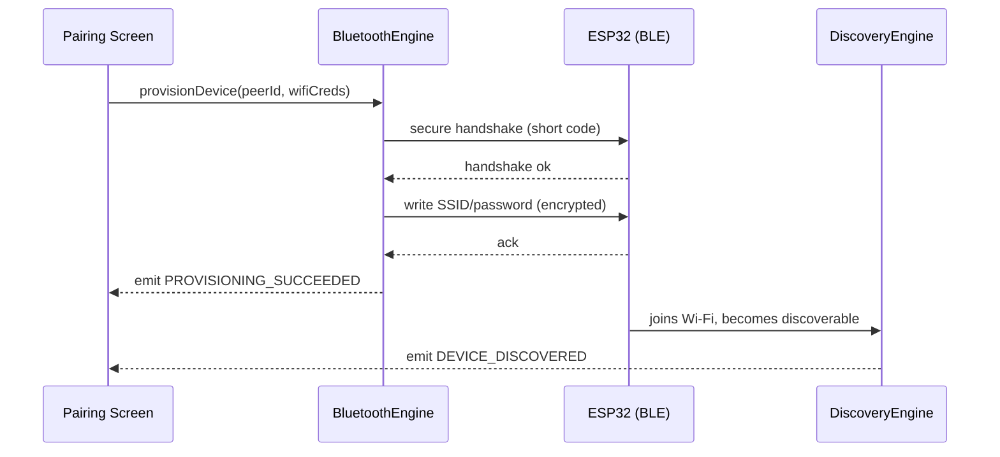
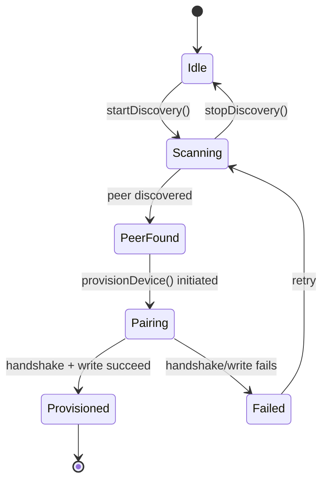

# Bluetooth Engine

## 1. Purpose

The Bluetooth Engine provides short-range, infrastructure-free connectivity
between the phone and devices: BLE-based provisioning (getting a device onto
Wi-Fi in the first place), and a Bluetooth mesh transport used as a fallback
communication path when no Wi-Fi/Internet channel is reachable.

**Status**: implemented as a **simulation** layered on top of
`engines/p2p-engine.ts` (`MobileP2PEngine`, `EngineId "p2p_engine"`).
⚠️ There is no real Bluetooth radio access anywhere in the codebase today —
`MobileP2PEngine` simulates peer discovery, pairing, and mesh delivery
in-process. This document specifies the Bluetooth Engine's real contract so
a genuine BLE library (e.g. `react-native-ble-plx`, native-module-only like
the MQTT client) can be swapped in behind the same interface without
touching any caller.

## 2. Responsibilities

- Scan for and pair with nearby BLE-capable devices, including devices that
  aren't on Wi-Fi yet (provisioning use case).
- Provide secure BLE-based Wi-Fi provisioning: hand a device its Wi-Fi
  credentials over an encrypted BLE characteristic rather than any
  unencrypted channel.
- Operate a Bluetooth mesh: peer discovery, multi-hop message relay with
  TTL and retries, so a phone or device that can't reach Wi-Fi can still
  send/receive through a neighbor that can.
- Store-and-forward: queue mesh messages for a peer that's temporarily out
  of range, matching the existing `MobileP2PEngine` offline queue.
- Serve as the [MQTT Communication Engine](MQTTCommunicationEngine.md)'s
  last-resort fallback channel before it gives up and queues offline
  entirely.

## 3. Features

- **Peer discovery** with periodic re-scan and staleness eviction (existing
  `MobileP2PEngine` behavior).
- **Mesh messaging** with TTL and retry counts to bound relay hops and
  avoid infinite loops.
- **Intelligent route selection**: prefers `direct_wifi` >
  `bluetooth_mesh` > other transports when multiple paths to a peer exist
  (existing `MobileP2PEngine` route table).
- **Gateway node registration**: a phone or device with both Wi-Fi and
  Bluetooth can register as a mesh gateway, bridging mesh traffic onto the
  Wi-Fi/cloud path for peers that have neither.
- **Maintenance sync**: periodic housekeeping pass to prune dead routes and
  re-announce presence to the mesh.
- **Secure provisioning handshake** (spec target): pairing requires the
  device to present a factory-set short code (QR/label on the device) before
  Wi-Fi credentials are ever written to it.

## 4. Workflow

1. **Start**: the engine begins periodic peer discovery on start (mirrors
   `MobileP2PEngine.startDiscovery()`).
2. **Pairing**: user selects a discovered device to provision; the engine
   performs the secure handshake, then writes Wi-Fi SSID/password over the
   (simulated today, real BLE later) characteristic.
3. **Provisioning confirmation**: the device is expected to switch to
   Wi-Fi and become discoverable there; the
   [Discovery Engine](DiscoveryEngine.md) picks it up from that point
   forward — the Bluetooth Engine's job for that device ends at successful
   handoff.
4. **Mesh operation** (independent of provisioning): peers continuously
   announce presence; the engine maintains a route table and relays
   messages hop-by-hop toward their destination, decrementing TTL each hop.
5. **Fallback invocation**: when [MQTTCommunicationEngine.md](MQTTCommunicationEngine.md)
   exhausts cloud/local/HTTP channels, it calls into this engine's mesh send
   path instead of queuing immediately.
6. **Store-and-forward**: if the destination peer isn't currently reachable,
   the message is held locally and retried as new peers/routes appear.

## 5. Internal Components

| Component | Responsibility |
|---|---|
| `PeerDiscovery` | Periodic scan, staleness eviction (existing `MobileP2PEngine` internals) |
| `MeshRouter` | Route table + intelligent path selection |
| `MeshMessenger` | TTL/retry-bounded multi-hop delivery |
| `StoreAndForwardQueue` | Holds messages for temporarily unreachable peers |
| `GatewayRegistry` | Tracks which peers can bridge mesh traffic to Wi-Fi/cloud |
| `ProvisioningHandshake` | Secure short-code pairing + credential write (spec target; simulated today) |

## 6. Public APIs

### `startDiscovery(): void` / `stopDiscovery(): void`
Starts/stops peer scanning (existing `MobileP2PEngine` methods).

### `provisionDevice(peerId: string, wifiCredentials: { ssid: string; password: string }): Promise<ProvisioningResult>`
Runs the secure handshake and hands off Wi-Fi credentials.

### `sendMeshMessage(destinationPeerId: string, payload: Record<string, unknown>, ttl?: number): Promise<boolean>`
Relays a message toward a peer through the mesh; used as the MQTT engine's
fallback path.

### `registerAsGateway(): void`
Opts this phone in as a bridge node for peers without direct Wi-Fi/cloud
access.

### `getPeers(): PeerInfo[]` / `getRoutes(): RouteEntry[]`
Introspection for the Dashboard/diagnostics UI.

## 7. Events

| Event | Payload | Emitted when |
|---|---|---|
| `BLUETOOTH_CONNECTED` | `{ peerId }` | Pairing succeeds |
| `BLUETOOTH_DISCONNECTED` | `{ peerId }` | Peer goes out of range/disconnects |
| `PEER_DISCOVERED` | `{ peer: PeerInfo }` | New peer found during scan |
| `MESH_MESSAGE_RELAYED` | `{ from, to, hop, ttlRemaining }` | Message forwarded one hop |
| `MESH_MESSAGE_DELIVERED` | `{ destinationPeerId }` | Final-hop delivery confirmed |
| `PROVISIONING_STARTED` / `PROVISIONING_SUCCEEDED` / `PROVISIONING_FAILED` | `{ peerId, reason? }` | Provisioning handshake lifecycle |

## 8. Database Schema

Via the [Database Engine](DatabaseEngine.md): a `mesh_routes` table (peer
id, next hop, transport, last-updated) and a `provisioned_devices` table
(peer id, provisioned-at timestamp) for history/diagnostics. Not persisted
today — `MobileP2PEngine`'s route table is in-memory only.

## 9. Local Storage

Store-and-forward queue contents (spec target: persisted so a queued mesh
message survives an app restart, mirroring the MQTT offline queue's
durability guarantee). Currently in-memory only in `MobileP2PEngine`.

## 10. Communication Interfaces

- **Internal**: [MQTT Communication Engine](MQTTCommunicationEngine.md)
  (fallback transport consumer), [Discovery Engine](DiscoveryEngine.md)
  (hands off a device once it's on Wi-Fi), [Security Engine](SecurityEngine.md)
  (provisioning handshake credential handling).
- **External**: BLE radio (via a real native BLE library once integrated;
  simulated in-process today — no actual radio access).

## 11. Security

- ⚠️ Today's simulation has no real cryptography on the "wire" because
  there is no real wire — it's an in-process event simulation. The spec
  requires that a real implementation encrypt the BLE characteristic used
  for credential transfer and require the factory short-code before any
  write.
- Mesh-relayed messages should be signed by the [Security Engine](SecurityEngine.md)
  at the origin so an intermediate relay node cannot tamper with payload
  content undetected, even though it can see routing metadata.
- `registerAsGateway()` should require explicit user opt-in (never silent),
  since a gateway node relays other users' traffic through this phone's
  radio and battery.

## 12. Error Handling

- Provisioning handshake failure (wrong short code, device unresponsive) →
  `PROVISIONING_FAILED` with a reason string; never leaves partially-written
  credentials on the device (all-or-nothing write).
- Mesh send with TTL exhausted before reaching destination → resolves
  `sendMeshMessage` to `false`, does not throw, so the MQTT engine's
  failover chain can move on to offline queueing.
- Peer disconnect mid-relay → in-flight message is requeued to
  store-and-forward rather than dropped.

## 13. Recovery Strategy

- Periodic re-scan re-discovers peers that dropped out of range; routes are
  recomputed rather than assumed stale-but-valid.
- Store-and-forward retries on every new peer/route event, not on a fixed
  timer alone, so recovery is immediate when connectivity returns rather
  than waiting for the next poll.
- Maintenance sync pass prunes routes that haven't been refreshed within a
  bounded window to avoid relaying into a stale/dead path.

## 14. Future Expansion

- Real BLE integration (native module, dev-client-only — same constraint
  pattern as the MQTT native transport).
- Bluetooth Low Energy mesh standard (e.g. Bluetooth SIG Mesh) instead of
  the current custom TTL/retry relay, for interoperability with third-party
  BLE mesh devices.
- Battery-aware gateway throttling (stop relaying for others below a
  battery threshold).

## 15. Integration Guide

To provision a new device type over BLE:
1. Implement the device-specific handshake step inside
   `ProvisioningHandshake` (short code format may differ per device family).
2. Do not bypass `provisionDevice()` — always go through the secure
   handshake, even for a "simple" device.
3. To use the mesh as a transport for a new feature, call
   `sendMeshMessage()` directly rather than depending on MQTT failover if
   the mesh is the *primary* channel for that feature.

## 16. Dependencies

[Security Engine](SecurityEngine.md) (signing/credential handling),
[Discovery Engine](DiscoveryEngine.md) (post-provisioning handoff),
[Event Engine](EventEngine.md), [Database Engine](DatabaseEngine.md)
(future persistence).

## 17. Sequence Diagram



## 18. State Diagram



## 19. Example API Usage

```ts
import { bluetoothEngine } from "@/engines/bluetooth-engine";

bluetoothEngine.startDiscovery();

bluetoothEngine.on("PEER_DISCOVERED", ({ peer }) => {
  console.log("Found nearby device:", peer.name);
});

const result = await bluetoothEngine.provisionDevice("peer-esp32-42", {
  ssid: "HomeNetwork",
  password: "••••••••",
});

// Used internally by the MQTT engine as a fallback:
await bluetoothEngine.sendMeshMessage("peer-esp32-42", { type: "ping" }, 5);
```

## 20. Extension Registration Process

```ts
gateway.registerEngine(
  {
    id: "p2p_engine", // Bluetooth Engine registers under the existing p2p_engine id
    name: "Bluetooth Engine",
    version: "1.0.0",
    capabilities: ["bluetooth", "mesh-transport", "provisioning"],
    subscribedActions: ["PROVISION_DEVICE", "SEND_MESH_MESSAGE"],
  },
  handleGatewayMessage,
);
```
