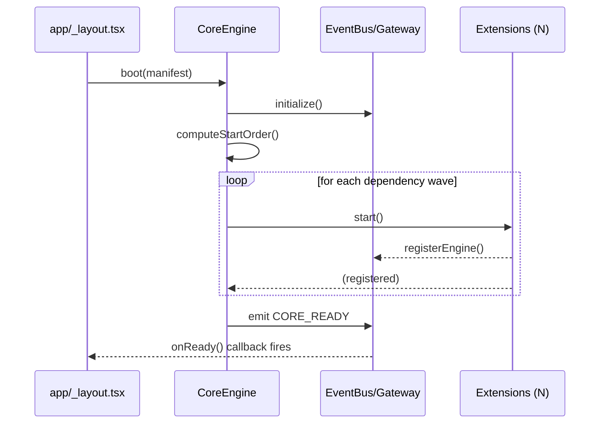
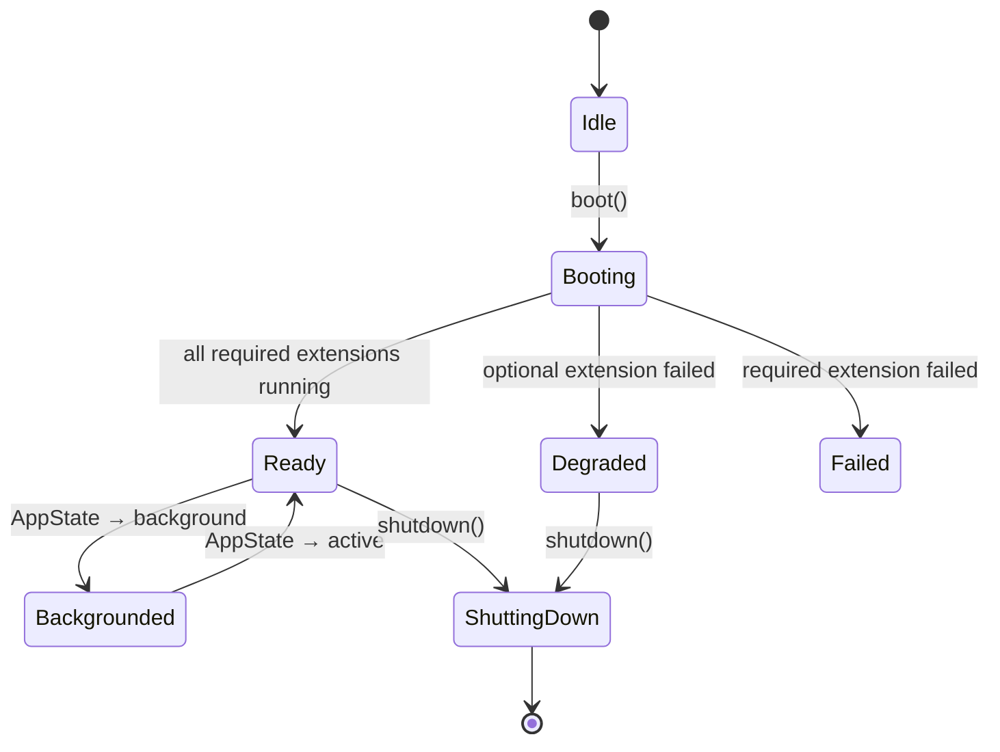

# Core Engine

## 1. Purpose

The Core Engine is the root runtime of the LUMA mobile application. It is
the first thing that starts when the app launches and the last thing that
stops when it terminates. Every other engine in this knowledge base is an
**extension** that plugs into the Core Engine rather than a standalone
system — the Core Engine is what makes "install/enable/disable an engine
without touching the rest of the app" possible at all.

It does not implement any smart-home behavior itself (no device control, no
discovery, no automation). Its entire job is orchestration: start engines in
the right order, route messages between them, keep the app alive in the
background, and tear everything down cleanly.

## 2. Responsibilities

- Own the application lifecycle (cold start → ready → background/foreground
  transitions → termination).
- Initialize the Internal API Gateway and Event Bus before any extension
  starts.
- Load, start, and stop every registered extension in dependency order.
- Provide the **service registry** — a lookup of which engines are
  currently running and what capabilities they expose.
- Provide **dependency injection** primitives so an extension can declare
  "I need the Security Engine's `signCommand`" without importing that
  engine's module directly.
- Route cross-engine messages via the gateway (delegated to the Event
  Engine's bus, see [EventEngine.md](EventEngine.md)).
- Keep critical extensions (communication, security) alive during background
  execution, subject to the OS's background execution limits on iOS/Android.
- Guarantee idempotent shutdown: calling stop twice, or stopping before
  start, must never throw or leak timers/listeners.

## 3. Features

- Deterministic boot order: `Database → Security → Event → Discovery/Comms
  → Device Management → everything else`.
- Guarded double-start / double-stop (see current `engines/index.ts`
  `started` flag — the Core Engine generalizes this per-extension).
- Health snapshot: `getEngineStatuses()` returns every registered engine's
  `status`, uptime, and last-heartbeat, mirroring the existing
  `EngineInfo` shape in `engines/internal-api/types.ts`.
- Crash isolation: one extension throwing during `start()` logs and
  continues booting the rest (already true today — see the `try/catch`
  around each `engine.start()` call in `engines/index.ts`).
- Cold-start budget tracking: the Core Engine records how long boot took so
  regressions (e.g. an extension blocking the JS thread) are visible in the
  Dashboard Engine's connection-health panel.

## 4. Workflow

1. **App mount** (`app/_layout.tsx`) renders the provider tree and fires a
   `CoreEngine.boot()` call once, guarded against React Strict Mode's
   double-invoke in development.
2. **Registry construction**: the Core Engine builds its extension manifest
   (statically bundled today; loaded via the Extension Engine's manifest
   once that engine exists) and computes a topological start order from each
   extension's declared `dependencies`.
3. **Sequential/parallel start**: extensions with no unmet dependencies start
   in parallel; each subsequent wave waits only for its declared
   dependencies, not the whole previous wave.
4. **Ready**: once every extension reports `running` (or a bounded timeout
   elapses for optional extensions), the Core Engine emits
   `CORE_READY` on the Event Bus. UI screens gate on this to avoid rendering
   with half-initialized state.
5. **Runtime**: the Core Engine does no polling itself; it only reacts to
   `ENGINE_ERROR` and `ENGINE_HEARTBEAT_MISSED` events to update the service
   registry.
6. **Background transition**: on `AppState` → `background`, the Core Engine
   tells non-critical extensions (Dashboard, Automation UI bindings) to
   pause their polling timers; communication/security/sync extensions keep
   running until the OS suspends the process.
7. **Shutdown**: reverse-dependency-order `stop()` calls (already the
   pattern in `engines/index.ts`'s `[...engines].reverse()`), then destroy
   the gateway and event bus last.

## 5. Internal Components

| Component | Responsibility |
|---|---|
| `ExtensionRegistry` | Holds the manifest of known extensions + their declared dependencies/capabilities |
| `Bootstrapper` | Computes start order and drives the boot sequence |
| `ServiceLocator` | Dependency-injection lookup (`locate<T>(capability): T`) so extensions don't import each other directly |
| `HealthMonitor` | Aggregates `EngineInfo` from the gateway into a single status snapshot |
| `LifecycleController` | Listens to React Native `AppState` and drives pause/resume of non-critical extensions |

## 6. Public APIs

### `boot(manifest?: ExtensionManifest[]): Promise<void>`
Starts the Core Engine and every registered extension. Idempotent — a
second call while already booted is a no-op that resolves immediately.
- **Returns**: resolves once every required (non-optional) extension is
  `running`, or rejects with `CoreBootError` if a required extension fails
  after retries.

### `shutdown(): Promise<void>`
Stops every extension in reverse dependency order, then tears down the
gateway and event bus.
- **Returns**: resolves once all `stop()` calls have settled (never
  rejects — individual extension stop failures are logged, not thrown).

### `getEngineStatuses(): EngineInfo[]`
Returns the current status of every registered extension (mirrors
`gateway.getAllEngines()` today).

### `locate<T>(capability: string): T | null`
Dependency-injection lookup by capability string (e.g.
`"command-signing"` → the Security Engine's signer). Returns `null` if no
running extension currently provides that capability, so callers can
degrade gracefully instead of crashing on a missing import.

### `onReady(cb: () => void): () => void`
Registers a callback fired once (or immediately, if already booted) when
`CORE_READY` has been emitted. Returns an unsubscribe function.

## 7. Events

| Event | Payload | Emitted when |
|---|---|---|
| `CORE_BOOT_STARTED` | `{ manifestSize: number }` | `boot()` begins |
| `CORE_READY` | `{ bootDurationMs: number, extensionCount: number }` | All required extensions report `running` |
| `CORE_EXTENSION_FAILED` | `{ engineId: EngineId, error: string }` | An extension throws during `start()` |
| `CORE_BACKGROUNDED` | `{}` | App enters background; non-critical extensions pause |
| `CORE_FOREGROUNDED` | `{}` | App resumes |
| `CORE_SHUTDOWN` | `{}` | `shutdown()` completes |

## 8. Database Schema

The Core Engine itself is stateless and persists nothing — it defers all
storage to the [Local Database Engine](DatabaseEngine.md). It only reads one
row at boot: the extension enable/disable table (`extension_state`, see
[ExtensionEngine.md](ExtensionEngine.md) §8) to know which optional
extensions to skip.

## 9. Local Storage

None owned directly. Boot-time configuration (which extensions are
enabled) is read through the Database Engine.

## 10. Communication Interfaces

- **Internal**: exclusively the Event Bus / Internal API Gateway (see
  [EventEngine.md](EventEngine.md)). The Core Engine is the only component
  allowed to call every extension's `start()`/`stop()` directly — everything
  else must go through gateway messages.
- **External**: none. The Core Engine never talks to the network or the
  backend directly.

## 11. Security

- The Core Engine enforces that extensions can only register under an
  `EngineId` present in its manifest — an unlisted ID is rejected at
  `registerEngine()` time, preventing a rogue/duplicate extension from
  impersonating a trusted one.
- Extension code itself is bundled with the app (no dynamic code loading),
  so there is no remote-code-execution surface at this layer; the Extension
  Engine's sandbox (§11 of [ExtensionEngine.md](ExtensionEngine.md)) is
  where that gets stricter once dynamic extensions are supported.

## 12. Error Handling

- Extension `start()` throwing → caught, logged via `CORE_EXTENSION_FAILED`,
  boot continues (matches current `engines/index.ts` behavior).
- Extension `stop()` throwing → caught, logged, shutdown continues (matches
  current behavior).
- `boot()` called while a previous `boot()` is still in flight → the second
  call awaits the first's in-flight promise rather than starting a
  duplicate boot sequence.
- A required extension that never reaches `running` within the boot timeout
  (default 10s) → `CoreBootError` with the list of stuck extensions; the app
  shows a "Some features may be limited" banner rather than a hard crash.

## 13. Recovery Strategy

- Optional extensions that fail to start are retried once, 2 seconds later,
  before being marked permanently `error` for the session — they can still
  be manually restarted from a future developer/debug panel.
- Required extensions (Event Bus, Security) failing to start is treated as
  fatal: the Core Engine surfaces a full-screen error rather than running in
  a half-booted state, since every other extension depends on them.
- On `CORE_FOREGROUNDED` after a long background period, the Core Engine
  asks each communication-capable extension to re-check its connection
  rather than assuming state is still fresh.

## 14. Future Expansion

- Dynamic extension loading via the Extension Engine (currently all
  extensions are statically imported in `engines/index.ts`).
- Per-extension resource budgets (max timers, max storage keys) enforced at
  the Core Engine level.
- A debug/developer screen backed by `getEngineStatuses()` for support
  diagnostics in the field.
- Cross-process boot (e.g. a background task / widget) sharing the same
  manifest without duplicating extension instances.

## 15. Integration Guide

To add a new extension to the Core Engine:
1. Implement the extension against the `Extension` interface (see
   [ExtensionEngine.md](ExtensionEngine.md) §6).
2. Add it to the manifest passed to `boot()` (today: add to the `engines`
   array in `engines/index.ts`).
3. Declare its `dependencies` (other `EngineId`s it needs already running)
   so the Bootstrapper sequences it correctly.
4. Do not import other extensions' internal modules — use
   `CoreEngine.locate()` or gateway messages only.

## 16. Dependencies

None — the Core Engine is the foundation every other engine depends on. It
depends only on the Event Engine and Internal API Gateway, which it also
owns the lifecycle of.

## 17. Sequence Diagram



## 18. State Diagram



## 19. Example API Usage

```ts
import { CoreEngine } from "@/core/CoreEngine";

// App bootstrap (app/_layout.tsx)
useEffect(() => {
  CoreEngine.boot().catch((err) => console.error("[Core] boot failed", err));
  return () => { void CoreEngine.shutdown(); };
}, []);

// Anywhere else in the app
const signer = CoreEngine.locate<CommandSigner>("command-signing");
if (signer) {
  const envelope = await signer.sign(payload, deviceKey);
}

const unsubscribe = CoreEngine.onReady(() => {
  console.log("[Core] all extensions running");
});
```

## 20. Extension Registration Process

The Core Engine is not itself registered as an extension — it is the
registrar. Every other engine registers against the gateway it owns via:

```ts
gateway.registerEngine(
  {
    id: "core_engine", // reserved; never used by a real extension
    name: "Core Engine",
    version: "1.0.0",
    capabilities: ["lifecycle", "service-registry", "dependency-injection"],
    subscribedActions: ["ENGINE_ERROR", "ENGINE_HEARTBEAT_MISSED"],
  },
  handleGatewayMessage,
);
```

Extensions register themselves during the Bootstrapper's start sequence
(see §17); the Core Engine does not pre-register on their behalf.
