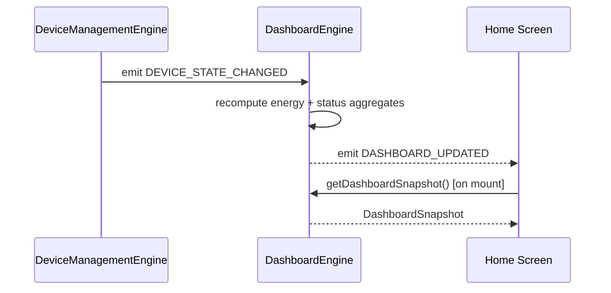
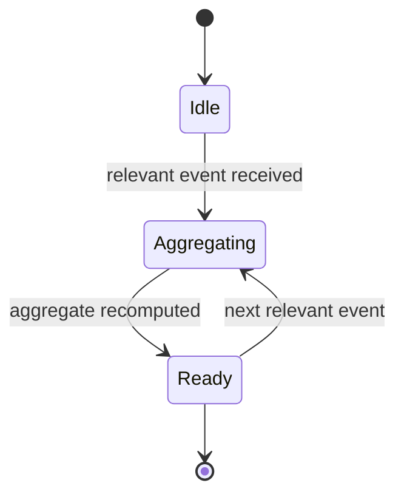

# Dashboard Engine

## 1. Purpose

The Dashboard Engine aggregates live data from every other engine into the
summarized views the home screen needs: device counts and status, energy
and cost totals, connection health, and recent activity — without the
Dashboard screen itself reaching into six different engines' internals.

**Status**: design spec. Today, dashboard-style aggregation
(`ENERGY_INSIGHTS`, `SAVINGS_SUMMARY` in `data/luma-data.ts`, plus derived
values computed ad hoc from `LumaContext`'s `lamps` array) happens directly
in screen components. This document specifies the Dashboard Engine as the
extraction point: one place that computes these aggregates from the
underlying engines' state, so the computation is testable and reusable
across screens (home dashboard, a future widget, etc.).

## 2. Responsibilities

- Aggregate device status counts (online/offline/unreachable) from
  [Device Management](DeviceManagementEngine.md) and
  [Discovery](DiscoveryEngine.md).
- Roll up energy/cost totals (today, month, projected annual) from
  per-device energy fields.
- Surface connection health: which [MQTT Communication Engine](MQTTCommunicationEngine.md)
  channel is active, transport type (native/simulated), and current
  latency/reconnect metrics.
- Generate energy insights (high-consumer alerts, efficiency callouts,
  anomaly flags) from device energy patterns — the logic behind
  `ENERGY_INSIGHTS`-style entries, generalized from static seed data into
  computed insights.
- Surface a recent-activity feed distinct from the
  [Notification Engine](NotificationEngine.md)'s alert feed (activity =
  a log of what happened; notifications = what needs attention).

## 3. Features

- Single `getDashboardSnapshot()` call returning every aggregate the home
  screen needs in one shape, computed fresh from live engine state (not a
  separately-maintained duplicate of it).
- Insight generation rules (spec target, generalizing the existing static
  `ENERGY_INSIGHTS` seed data): "device using > X% of total energy",
  "device reporting 0 power while nominally on" (standby-drain
  detection), "month-over-month cost trending down/up by Y%".
- Connection-health panel data: active channel, transport (native/
  simulated — surfacing the [MQTTCommunicationEngine.md](MQTTCommunicationEngine.md)
  honesty badge at the dashboard level too), reconnect attempt count.
- Activity feed combining device/scene/schedule/login/firmware/automation
  entries (`ActivityLog` shape in `data/luma-data.ts`) from the engines
  that produce them.

## 4. Workflow

1. **Subscribe**: on mount, the Dashboard Engine subscribes to
   `DEVICE_STATE_CHANGED`, `BROKER_CONNECTED`/`DISCONNECTED`,
   `AUTOMATION_EXECUTED`, and firmware/discovery events relevant to its
   aggregates.
2. **Recompute on change**: rather than polling, each relevant event
   triggers a targeted recompute of just the affected aggregate (e.g. a
   device state change recomputes energy totals and device counts, not the
   whole snapshot).
3. **Insight pass**: on a coarser interval (e.g. every few minutes, not on
   every event) the engine re-runs the insight-generation rules over
   current device data, since these are comparative/trend-based rather than
   event-driven.
4. **Snapshot delivery**: the Dashboard screen calls
   `getDashboardSnapshot()` on mount and subscribes to
   `DASHBOARD_UPDATED` for incremental refresh, avoiding a full
   re-aggregation on every render.
5. **Activity logging**: other engines emit domain events that the
   Dashboard Engine also appends to the activity feed (read-only observer;
   it doesn't own the source of truth for those events, just their
   presentation as a unified timeline).

## 5. Internal Components

| Component | Responsibility |
|---|---|
| `DeviceStatusAggregator` | Counts by online/offline/unreachable |
| `EnergyAggregator` | Sums today/month totals, computes projected annual |
| `InsightGenerator` | Comparative/anomaly rules over device energy data |
| `ConnectionHealthReporter` | Surfaces active channel/transport/metrics |
| `ActivityFeedCollector` | Merges cross-engine events into one timeline |

## 6. Public APIs

### `getDashboardSnapshot(): DashboardSnapshot` (spec target)
Returns the full aggregate: device counts, energy/cost summary, insights,
connection health, recent activity — computed from current engine state.

### `onUpdate(cb: (snapshot: DashboardSnapshot) => void): () => void` (spec target)
Subscribes to incremental snapshot updates.

### `getInsights(): EnergyInsight[]` (spec target)
Returns just the generated insight list, for a dedicated insights screen.

## 7. Events

| Event | Payload | Emitted when |
|---|---|---|
| `DASHBOARD_UPDATED` | partial or full `DashboardSnapshot` | Any tracked aggregate recomputes |
| `INSIGHT_GENERATED` | `EnergyInsight` | The periodic insight pass produces a new/changed insight |

## 8. Database Schema

The Dashboard Engine is a read-model layer — it does not own primary data,
only computed aggregates. Via the [Database Engine](DatabaseEngine.md), it
may cache the last computed snapshot (`dashboard_snapshot_cache`) purely
for instant paint on cold start, refreshed immediately once live engine
data is available.

## 9. Local Storage

Optional last-snapshot cache as described in §8; not required for
correctness, only for perceived load-time performance.

## 10. Communication Interfaces

- **Internal**: reads from [Device Management](DeviceManagementEngine.md),
  [Discovery](DiscoveryEngine.md),
  [MQTT Communication Engine](MQTTCommunicationEngine.md),
  [Firmware Engine](FirmwareEngine.md),
  [Automation Engine](AutomationEngine.md) — strictly read-only, it never
  issues commands to any of them.
- **External**: none.

## 11. Security

- The Dashboard Engine only aggregates data the current user's role already
  has visibility into — it must not, for example, surface another
  household member's private activity if a future multi-tenant model
  restricts that; today's single-household model has no such restriction,
  but the aggregation layer should be built to respect one once it exists.

## 12. Error Handling

- A source engine being temporarily unavailable (e.g. Discovery not yet
  started) → that portion of the snapshot returns a clearly-marked
  "unavailable" state rather than a stale zero that looks like a real
  reading of "no devices."
- Insight generation on insufficient data (e.g. no energy history yet) →
  simply produces no insights for that category, not a placeholder/fake
  insight.

## 13. Recovery Strategy

- Snapshot recomputation is idempotent and cheap to re-run entirely on
  reconnect/resume — no special recovery path needed beyond re-subscribing
  to source events, which the Core Engine's foreground transition already
  triggers.

## 14. Future Expansion

- Historical trend charts (multi-day/week energy graphs) beyond today's
  today/month totals.
- Per-room/per-floor aggregation views.
- Exportable reports (CSV/PDF) generated from the same aggregation layer.
- A home-screen widget (OS-level) backed by the cached snapshot for
  glanceable status without opening the app.

## 15. Integration Guide

Any new engine that produces dashboard-relevant data should:
1. Emit a well-named event via the [Event Engine](EventEngine.md) rather
   than expecting the Dashboard Engine to poll it.
2. Avoid pushing pre-aggregated summaries into this engine — hand it raw
   facts (a device's current energy reading, not "today's total") and let
   the aggregators here compute derived values consistently.

## 16. Dependencies

[Device Management Engine](DeviceManagementEngine.md),
[Discovery Engine](DiscoveryEngine.md),
[MQTT Communication Engine](MQTTCommunicationEngine.md),
[Firmware Engine](FirmwareEngine.md),
[Automation Engine](AutomationEngine.md), [Event Engine](EventEngine.md),
[Database Engine](DatabaseEngine.md) (optional cache).

## 17. Sequence Diagram



## 18. State Diagram



## 19. Example API Usage

```ts
import { dashboardEngine } from "@/engines/dashboard-engine";

const snapshot = dashboardEngine.getDashboardSnapshot();
console.log(`${snapshot.devicesOnline}/${snapshot.devicesTotal} online`);
console.log(`Today: $${snapshot.energy.costToday}`);

const unsubscribe = dashboardEngine.onUpdate((next) => {
  console.log("Dashboard refreshed:", next.energy.costToday);
});
```

## 20. Extension Registration Process

```ts
gateway.registerEngine(
  {
    id: "dashboard_engine",
    name: "Dashboard Engine",
    version: "1.0.0",
    capabilities: ["aggregation", "insight-generation"],
    subscribedActions: [
      "DEVICE_STATE_CHANGED",
      "BROKER_CONNECTED",
      "BROKER_DISCONNECTED",
      "AUTOMATION_EXECUTED",
      "FIRMWARE_UPDATED",
      "DEVICE_DISCOVERED",
    ],
  },
  handleGatewayMessage,
);
```
