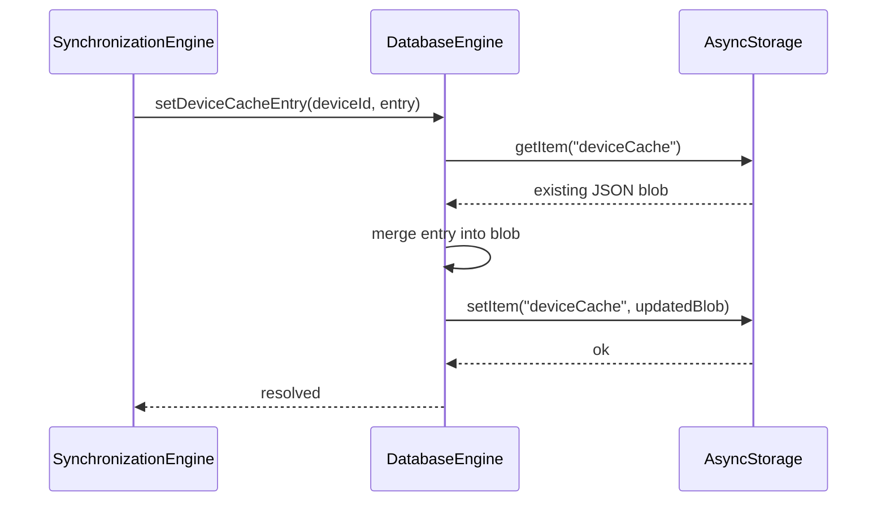
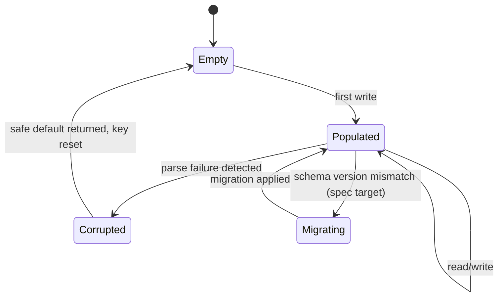

# Local Database Engine

## 1. Purpose

The Local Database Engine is the single point of access to on-device
persistent storage. Every other engine that needs to remember something
across app restarts goes through this engine rather than calling
AsyncStorage (or any future storage backend) directly — so the storage
technology can change once, in one place, without touching every consumer.

**Status**: implemented, scoped to the MQTT module
(`src/modules/mqtt/MQTTStorage.ts`), which is the sole AsyncStorage access
point *for that module*. It is not yet a shared, app-wide engine — other
parts of the app (`LumaContext`'s users/notifications/automations) hold
their state purely in memory with no persistence at all. This document
specifies the Local Database Engine as the generalization of
`MQTTStorage.ts`'s pattern to every domain that needs durability.

## 2. Responsibilities

- Provide a single, typed, namespaced key-value (today) / relational
  (future) storage API that every engine uses instead of touching
  AsyncStorage directly.
- Own the schema/shape of every persisted record so a storage-format change
  happens in one file, not scattered `JSON.parse`/`JSON.stringify` calls.
- Guarantee that a read failure (corrupted/missing data) never throws
  upward uncaught — callers get a safe default and the corruption is
  logged.
- Provide migration support: when a persisted shape changes version, old
  data is either migrated or safely discarded, never left to crash a
  `JSON.parse` on next read.

## 3. Features

- Currently: AsyncStorage-backed key-value store, one JSON blob per logical
  collection (sessions, offline queue, device cache, device registry,
  replay nonces, discovered devices — all in `MQTTStorage.ts` today).
- Read-modify-write helpers (`getX`/`setX` pairs) so callers never
  hand-roll a `JSON.parse(await AsyncStorage.getItem(...))` themselves.
- Spec target: typed table accessors (`table<T>(name)`) so new domains
  (devices, users, automation rules, notifications — see each of those
  engines' §8/§9) get the same ergonomics without copy-pasting
  `MQTTStorage.ts`'s pattern by hand.
- Spec target: a lightweight schema-version stamp per collection so a
  future migration to SQLite/MMKV (see §14) can detect and convert old
  AsyncStorage-shaped data rather than silently losing it.

## 4. Workflow

1. **Read**: a caller asks for a named collection (e.g.
   `getDeviceCache()`); the engine reads the AsyncStorage key, parses JSON,
   and returns a typed object — or an empty default if the key doesn't
   exist yet.
2. **Write**: a caller asks to persist a named collection (e.g.
   `setDeviceCacheEntry(deviceId, entry)`); the engine reads the current
   full blob, merges in the change, and writes the whole blob back (today's
   read-modify-write pattern — see §14 for why this doesn't scale
   indefinitely).
3. **Corruption handling**: if a stored value fails to parse as JSON, the
   engine logs the failure and returns the collection's empty default
   rather than propagating the parse error.
4. **Migration (spec target)**: on first read of a collection after an app
   update, the engine checks a stored schema-version stamp; a mismatch
   triggers either an in-place transform or a documented reset, never a
   silent shape mismatch downstream.

## 5. Internal Components

| Component | Responsibility |
|---|---|
| `AsyncStorageAdapter` | Current backend: raw AsyncStorage get/set/JSON |
| `CollectionAccessor` | Typed get/set helpers per named collection |
| `CorruptionGuard` | Catches parse failures, returns safe defaults |
| `SchemaVersionStamp` (spec target) | Per-collection version tag for future migrations |

## 6. Public APIs

Existing accessors (from `MQTTStorage.ts`, representative — the actual set
covers sessions, queue, device cache, device registry, replay nonces,
discovered devices):

### `getQueue(): Promise<QueuedOperation[]>` / `setQueue(queue): Promise<void>`
Offline command queue persistence (used by
[SynchronizationEngine.md](SynchronizationEngine.md)).

### `getDeviceCache(): Promise<Record<string, CachedDeviceState>>` / `setDeviceCacheEntry(deviceId, entry): Promise<void>`
Per-device cached state with version stamps (used by
[SynchronizationEngine.md](SynchronizationEngine.md)).

### `getDeviceRegistry(): Promise<Record<string, DeviceRegistryEntry>>` / `setDeviceRegistryEntry(entry): Promise<void>`
Hashed device keys (used by [PermissionEngine.md](PermissionEngine.md) /
[SecurityEngine.md](SecurityEngine.md)).

### `getDiscoveredDevices(): Promise<Record<string, DiscoveredESP32>>` / `setDiscoveredDevices(cache): Promise<void>`
Discovery cache (used by [DiscoveryEngine.md](DiscoveryEngine.md)).

### `setSession(channelId, session): Promise<void>`
Per-channel MQTT session metadata (used by
[MQTTCommunicationEngine.md](MQTTCommunicationEngine.md)).

Spec target, generalized accessor for new domains:
### `table<T>(name: string): { get(): Promise<T[]>; set(rows: T[]): Promise<void>; getById(id): Promise<T | null>; upsert(row: T): Promise<void> }`

## 7. Events

| Event | Payload | Emitted when |
|---|---|---|
| `STORAGE_WRITE_FAILED` | `{ collection, error }` | An AsyncStorage write throws |
| `STORAGE_CORRUPTION_DETECTED` | `{ collection }` | A stored value fails to parse |
| `STORAGE_MIGRATED` | `{ collection, fromVersion, toVersion }` | A schema migration runs (spec target) |

## 8. Database Schema

Current collections (each a single AsyncStorage key holding a JSON blob):
`sessions`, `queue`, `deviceCache`, `device_registry`, `replay_nonces`,
`discoveredDevices` — all defined in `MQTTStorage.ts`.

Spec target additions as other engines adopt this pattern: `devices`,
`schedules`, `scenes` ([DeviceManagementEngine.md](DeviceManagementEngine.md)),
`users`, `access_requests` ([PermissionEngine.md](PermissionEngine.md)),
`automation_rules` ([AutomationEngine.md](AutomationEngine.md)),
`notifications` ([NotificationEngine.md](NotificationEngine.md)),
`extension_state` ([ExtensionEngine.md](ExtensionEngine.md)),
`firmware_jobs` ([FirmwareEngine.md](FirmwareEngine.md)).

## 9. Local Storage

AsyncStorage is the only backend in use today. There is no SQLite or MMKV
usage anywhere in the codebase currently — this is stated explicitly here
because "Local Storage" and "Database Schema" for every other engine in
this knowledge base point back to this engine's AsyncStorage reality, not
to a relational database that doesn't exist yet.

## 10. Communication Interfaces

- **Internal**: every other engine that persists data goes through this
  engine — no engine should call `AsyncStorage` directly outside this
  engine's implementation.
- **External**: none — this engine never talks to the network; cloud
  backup/sync of local data is a distinct concern belonging to a future
  Synchronization-Engine-to-backend bridge, not to this engine directly.

## 11. Security

- Only hashed/non-sensitive data should ever be written here in plaintext
  (see [SecurityEngine.md](SecurityEngine.md) §11 — plaintext keys must
  never reach this engine at all, hashed only).
- AsyncStorage on both iOS and Android is not encrypted by default; this
  engine does not add its own encryption layer today. Anything genuinely
  sensitive (rather than just "private," like hashed keys which are already
  one-way) should not be stored here without an additional encryption step
  — flagged as a gap for future hardening, not silently assumed safe.

## 12. Error Handling

- A read for a collection that has never been written → returns the
  collection's typed empty default (`{}` or `[]`), never `undefined` or a
  thrown error.
- A write failure (AsyncStorage quota, OS-level failure) → caught, logged,
  `STORAGE_WRITE_FAILED` emitted; the in-memory state the caller was trying
  to persist is not rolled back automatically — callers should treat a
  failed persist as "will retry on next write," not as a fatal condition.
- Corrupted JSON on read → `STORAGE_CORRUPTION_DETECTED` emitted, safe
  default returned, corrupted key optionally cleared to prevent repeated
  failures on every subsequent read.

## 13. Recovery Strategy

- No automatic backup/restore exists today — a corrupted or cleared
  AsyncStorage collection is simply reset to empty; loss is visible via
  §7's events, not silent.
- Collections holding cache-only data (device cache, discovered devices)
  are safe to lose entirely and will repopulate from live traffic;
  collections holding non-recoverable identity data (device registry keys)
  losing data means those devices need re-registration — this asymmetry
  should inform any future backup prioritization.

## 14. Future Expansion

- Migrate from single-JSON-blob-per-collection to SQLite (via
  `expo-sqlite`) or MMKV for collections that grow large or need querying
  (e.g. `automation_rules`, `notifications`, `firmware_jobs` history) —
  the current read-modify-write-whole-blob pattern does not scale past a
  few hundred entries per collection.
- Per-collection schema versioning and migration runner (see §6's
  `SchemaVersionStamp`).
- Optional encryption-at-rest for genuinely sensitive collections.
- Cloud backup/restore of local data via the backend, explicitly opt-in.

## 15. Integration Guide

Any engine that needs to persist something:
1. Add a new named collection/accessor pair to this engine rather than
   calling AsyncStorage directly from your own module.
2. Define the record shape as a TypeScript interface exported from this
   engine (or your own module, re-exported here) so consumers get type
   safety on read.
3. Keep blobs reasonably small — if a collection is expected to grow
   unbounded (activity logs, notification history), plan for the SQLite
   migration path (§14) rather than assuming the JSON-blob pattern will
   scale.

## 16. Dependencies

None — this is a foundational engine other engines depend on.

## 17. Sequence Diagram



## 18. State Diagram



## 19. Example API Usage

```ts
import { getDeviceCache, setDeviceCacheEntry } from "@/modules/mqtt/MQTTStorage";

const cache = await getDeviceCache();
console.log(cache["L001"]?.state);

await setDeviceCacheEntry("L001", {
  deviceId: "L001",
  version: 42,
  updatedAt: Date.now(),
  state: { on: true, brightness: 60 },
});
```

## 20. Extension Registration Process

```ts
gateway.registerEngine(
  {
    id: "database_engine",
    name: "Local Database Engine",
    version: "1.0.0",
    capabilities: ["persistence", "key-value-storage"],
    subscribedActions: [],
  },
  handleGatewayMessage,
);
```
