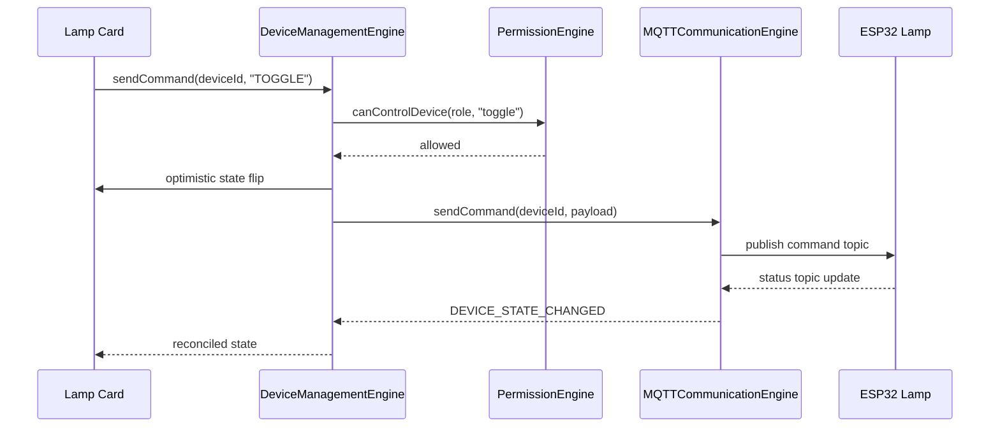
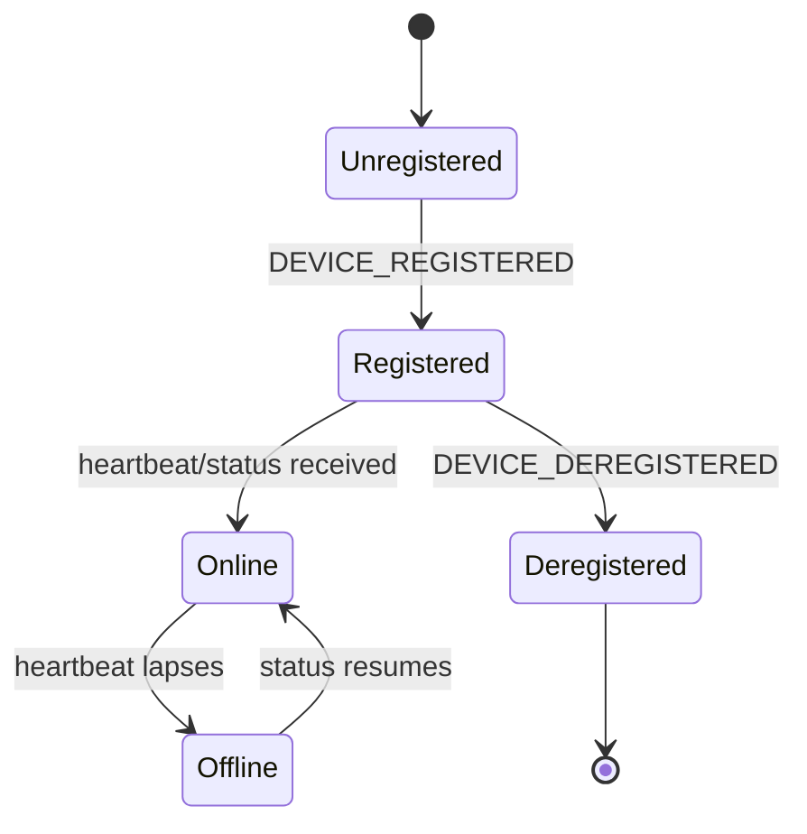

# Device Management Engine

## 1. Purpose

The Device Management Engine is the single source of truth for "what
devices exist, what state are they in, and how do I change that state."
Every screen that shows or controls a lamp/device reads from this engine
rather than talking to MQTT, discovery, or storage directly.

**Status**: split across two layers today. `engines/device-engine.ts`
(`MobileDeviceEngine`, `EngineId "device_engine"`) is the thin
gateway-facing command dispatcher; `context/LumaContext.tsx` holds the
actual rich domain model (`Lamp`, `Scene`, schedules, health, energy) as
in-memory React state with no persistence layer wired in yet. This
document specifies the Device Management Engine as the unification target:
`LumaContext`'s domain shape, driven through `MobileDeviceEngine`'s
gateway contract, backed by the [Database Engine](DatabaseEngine.md) for
persistence.

## 2. Responsibilities

- Own the canonical device list and each device's current state (`Lamp`
  shape: power, brightness, color temp, RGB, voltage/current/power,
  energy/cost counters, schedules, health).
- Dispatch commands (`TURN_ON`, `TURN_OFF`, `TOGGLE`, `SET_BRIGHTNESS`,
  `SET_COLOR`, `SET_TEMP`, `REBOOT`) to the correct device via the
  [MQTT Communication Engine](MQTTCommunicationEngine.md), after the
  [Permission Engine](PermissionEngine.md) confirms the caller's role
  allows it.
- Apply state updates arriving from the device (`DEVICE_STATE_CHANGED`)
  back into the canonical model, deduplicated via the
  [Synchronization Engine](SynchronizationEngine.md)'s version check.
- Register/deregister devices as the [Discovery Engine](DiscoveryEngine.md)
  finds or loses them.
- Track per-device health (RSSI, signal quality, uptime, restart count,
  CPU/memory) and energy/cost accumulation for the Dashboard.

## 3. Features

- Command dispatch with priority (`"high"` for user-initiated commands,
  matching the existing `gateway.sendCommand(..., "high")` calls).
- Full device registry with rich per-device health telemetry, not just
  on/off state.
- Scene support: named groups of device states applied together
  (`Scene` in `LumaContext`).
- Per-device schedule list (daily/one-off on/off timers), separate from the
  [Automation Engine](AutomationEngine.md)'s conditional rules — schedules
  are simple time triggers owned here; rules with arbitrary
  trigger/action pairs belong to Automation.
- Energy/cost tracking per device, aggregated for the Dashboard's savings
  summary.

## 4. Workflow

1. **Registration**: on `DEVICE_REGISTERED` (from Discovery via the
   gateway), the engine adds a new `Lamp` entry with defaults, or updates
   an existing one if the device was previously known but offline.
2. **Command**: UI calls `sendCommand(deviceId, command, params)`. The
   engine checks with the Permission Engine
   (`canControlDevice(role, command)`), then forwards to the
   Communication Engine for delivery.
3. **Optimistic update**: the UI-visible state updates optimistically on
   dispatch (e.g. toggling a switch flips immediately) and is reconciled
   against `DEVICE_STATE_CHANGED` once the device confirms — a mismatch
   after a timeout reverts the optimistic change and surfaces an error via
   the [Notification Engine](NotificationEngine.md).
4. **Inbound state**: `DEVICE_STATE_CHANGED` messages update the canonical
   `Lamp` record; health/energy fields are merged, not replaced, so a
   partial status payload doesn't blank out unrelated fields.
5. **Listing**: `listDevices()` triggers a `DEVICE_LIST` response used to
   reconcile the full registry on cold start, before individual
   `DEVICE_STATE_CHANGED` events start arriving.

## 5. Internal Components

| Component | Responsibility |
|---|---|
| `MobileDeviceEngine` (`device-engine.ts`) | Gateway-facing command dispatch + inbound message handling |
| `DeviceRegistry` (spec target, currently `LumaContext` state) | Canonical `Lamp`/`Scene` domain model |
| `OptimisticUpdateTracker` | Applies-then-reconciles UI-visible state changes |
| `EnergyAccumulator` | Rolls up per-device power draw into today/month totals |

## 6. Public APIs

### `sendCommand(deviceId: string, command: DeviceCommand, params?: Record<string, unknown>): void`
Dispatches a device command through the gateway (existing
`MobileDeviceEngine` method).

### `requestDevice(deviceId: string): void` / `listDevices(): void`
Requests a single device's current state, or the full registry.

### `onState(cb: (update: DeviceState) => void): void`
Subscribes to inbound state updates (existing method — spec target:
replace the single-callback shape with the Event Engine's multi-subscriber
`on()`).

### `getDevices(): Lamp[]` (spec target)
Synchronous read of the current canonical registry, for screens that don't
want to hold their own subscription.

### `applyScene(sceneId: string): Promise<void>` (spec target)
Applies every device state in a named scene as a single batch of commands.

## 7. Events

| Event | Payload | Emitted when |
|---|---|---|
| `DEVICE_REGISTERED` | device summary | New device added to the registry |
| `DEVICE_DEREGISTERED` | `{ deviceId }` | Device removed (factory reset, unpaired) |
| `DEVICE_STATE_CHANGED` | `DeviceState` | Any field of a device's state updates |
| `DEVICE_COMMAND_FAILED` | `{ deviceId, command, reason }` | Optimistic update reconciliation fails |
| `SCENE_APPLIED` | `{ sceneId, deviceIds }` | A scene finishes applying |

## 8. Database Schema

Via the [Database Engine](DatabaseEngine.md): `devices` (id, name, room,
floor, mac, firmware, last known state as JSON), `schedules` (device id,
type, time, action, enabled), `scenes` (id, name, device state snapshot as
JSON). Not persisted today — `LumaContext` state resets on app restart.

## 9. Local Storage

None today (in-memory `useState` only). Spec target: persist the device
registry so the app shows last-known state immediately on cold start,
matching the pattern already used for discovery's cache.

## 10. Communication Interfaces

- **Internal**: [MQTT Communication Engine](MQTTCommunicationEngine.md)
  (command delivery + inbound state), [Permission Engine](PermissionEngine.md)
  (command gating), [Discovery Engine](DiscoveryEngine.md) (registration
  source), [Automation Engine](AutomationEngine.md) (rule-triggered
  commands flow through here too), [Notification Engine](NotificationEngine.md)
  (command failure surfacing).
- **External**: none directly — always through the Communication Engine.

## 11. Security

- Every command is checked against `canControlDevice()`
  ([Permission Engine](PermissionEngine.md)) before dispatch — the Device
  Management Engine never bypasses role gating even for "safe-looking"
  commands like brightness.
- Device deregistration (factory reset) requires the `owner` role, matching
  the `factory_reset` entry in the Permission Engine's allowlist.

## 12. Error Handling

- Command dispatched to an unknown `deviceId` → rejected before reaching
  the gateway with `UnknownDeviceError`, rather than sending a command
  into the void.
- Optimistic update not reconciled within a bounded timeout (default 8s)
  → reverted, `DEVICE_COMMAND_FAILED` emitted with reason `"timeout"`.
- Partial/malformed inbound state payload → only recognized fields are
  merged; unrecognized fields are logged and dropped rather than corrupting
  the record.

## 13. Recovery Strategy

- On [MQTTCommunicationEngine.md](MQTTCommunicationEngine.md) reconnect,
  `listDevices()` is re-issued to force a full reconciliation pass, in
  addition to the Synchronization Engine's version-checked incremental
  sync.
- A device marked `unreachable` by Discovery keeps its last-known state
  visible (with a stale indicator) rather than clearing it, so the user
  isn't shown a blank card.

## 14. Future Expansion

- Persist the device registry (see §9).
- Batch command support (apply one command to a room/floor group).
- Historical state timeline per device (beyond today's energy totals) for
  a usage-over-time chart.
- Device grouping/tagging beyond the current room/floor fields.

## 15. Integration Guide

To add a new controllable device attribute:
1. Add the field to the `Lamp` shape and to `DEVICE_STATE_CHANGED`'s
   payload contract.
2. Add a new `DeviceCommand` value only if it needs a distinct
   command verb; prefer `SET_*` with a `params` field for simple value
   changes.
3. Add the command to [PermissionEngine.md](PermissionEngine.md)'s
   `GatedCommand` union and assign it to the correct roles before wiring
   any UI to it.

## 16. Dependencies

[MQTT Communication Engine](MQTTCommunicationEngine.md),
[Permission Engine](PermissionEngine.md),
[Discovery Engine](DiscoveryEngine.md),
[Synchronization Engine](SynchronizationEngine.md),
[Event Engine](EventEngine.md), [Database Engine](DatabaseEngine.md).

## 17. Sequence Diagram



## 18. State Diagram



## 19. Example API Usage

```ts
import { mobileDeviceEngine } from "@/engines/device-engine";

mobileDeviceEngine.onState((update) => {
  console.log(`${update.deviceId} state:`, update.state);
});

mobileDeviceEngine.sendCommand("L001", "SET_BRIGHTNESS", { brightness: 60 });
mobileDeviceEngine.listDevices();
```

## 20. Extension Registration Process

```ts
gateway.registerEngine(
  {
    id: "device_engine",
    name: "Device Management Engine",
    version: "1.0.0",
    capabilities: ["device_commands", "state_management", "device_registry"],
    subscribedActions: [
      "DEVICE_REGISTERED",
      "DEVICE_DEREGISTERED",
      "DEVICE_STATE_CHANGED",
      "DEVICE_DATA",
      "DEVICE_LIST",
      "DEVICE_FIRMWARE_UPDATED",
    ],
  },
  handleGatewayMessage,
);
```
