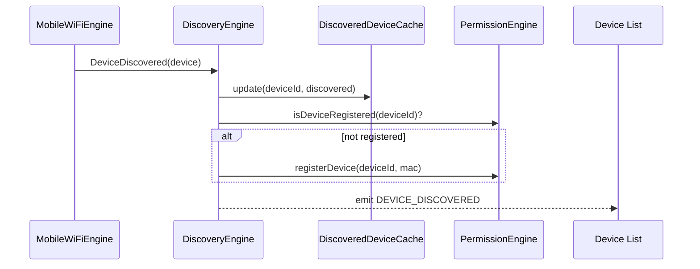
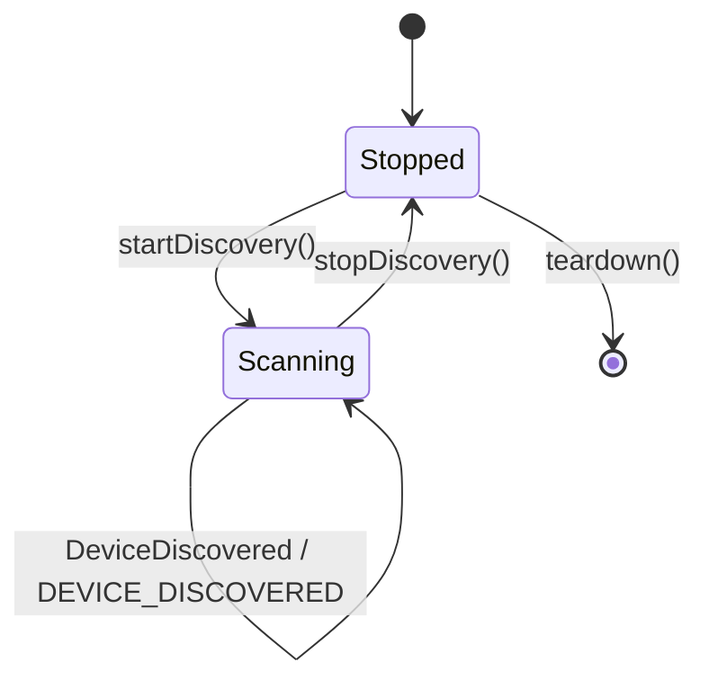

# Device Discovery Engine

## 1. Purpose

The Discovery Engine finds ESP32 devices on the local network and keeps
their reachability info (IP, hostname, last-seen) fresh, so the rest of the
app never has to run its own network scan. It's the entry point for "a new
device just showed up" and "a known device's IP address changed."

**Status**: implemented as a **simulation**. `engines/wifi-engine.ts`
(`MobileWiFiEngine`) simulates mDNS/UDP-broadcast/heartbeat discovery;
`src/modules/mqtt/MQTTDiscovery.ts` is a thin adapter that subscribes to the
WiFi Engine's real events and republishes them as MQTT-domain events —
deliberately *not* re-simulating discovery itself, so a production swap only
touches the WiFi Engine layer. ⚠️ There is no real mDNS/UDP socket code
anywhere; production would replace only the WiFi Engine's discovery
internals (e.g. with `react-native-zeroconf` or a native UDP socket).

## 2. Responsibilities

- Discover ESP32 devices via simulated mDNS, UDP broadcast, and heartbeat
  methods, each tagged with which method found them (`discoveryMethod`).
- Track device online/offline/unreachable status and update it as
  heartbeats arrive or lapse.
- Detect and propagate IP address changes for already-known devices (DHCP
  lease renewal case).
- Cache discovered devices to local storage so the last-known device list
  is available immediately on app start, before a fresh scan completes.
- Auto-register newly discovered devices with the
  [Permission Engine](PermissionEngine.md) if they aren't already known.

## 3. Features

- Three discovery methods modeled explicitly (`mdns`, `udp_broadcast`,
  `heartbeat`) so the UI/diagnostics can show *how* a device was found.
- Persistent discovered-device cache (`MQTTStorage`'s
  `getDiscoveredDevices`/`setDiscoveredDevices`), so a cold app start shows
  known devices immediately.
- IP-address-change propagation without requiring re-discovery from
  scratch (`IPAddressUpdated` event path).
- Network monitoring + auto-recovery in the underlying WiFi Engine (retries
  discovery after a network change, e.g. switching Wi-Fi networks).
- Idempotent `startDiscovery()` — calling it while already running is a
  no-op that doesn't spawn a second scan loop (existing `MQTTDiscovery`
  `started` guard).

## 4. Workflow

1. **Start**: `startDiscovery()` subscribes to the WiFi Engine's
   `DeviceDiscovered` and `IPAddressUpdated` events, then calls
   `mobileWiFiEngine.startDiscovery()`.
2. **Discovery event**: on `DeviceDiscovered`, the engine converts the
   WiFi Engine's `RegisteredDevice` into the Discovery Engine's own
   `DiscoveredESP32` shape, updates the local cache, emits
   `DEVICE_DISCOVERED`, and auto-registers the device with the Permission
   Engine if it's new.
3. **IP change event**: on `IPAddressUpdated`, the engine patches the
   cached entry's `ip` field and emits `DEVICE_UPDATED` — no full
   re-registration needed.
4. **Stop**: `stopDiscovery()` tells the WiFi Engine to stop scanning but
   keeps the current cache intact (last-known state remains visible).
5. **Teardown**: `teardown()` fully unsubscribes and resets internal state
   — used only on engine shutdown, not on a normal pause.
6. **Consumers**: [Device Management](DeviceManagementEngine.md) and
   [MQTT Communication](MQTTCommunicationEngine.md) both subscribe to
   `DEVICE_DISCOVERED`/`DEVICE_UPDATED` rather than polling this engine.

## 5. Internal Components

| Component | Responsibility |
|---|---|
| `MobileWiFiEngine` (`wifi-engine.ts`) | Underlying scan simulation: mDNS/UDP/heartbeat, network monitoring, auto-recovery |
| `DiscoveryAdapter` (`MQTTDiscovery.ts`) | Subscribes to WiFi Engine events, republishes as Discovery domain events, manages the cache |
| `DiscoveredDeviceCache` | Persisted map of `deviceId → DiscoveredESP32` |

## 6. Public APIs

### `startDiscovery(): void` / `stopDiscovery(): void`
Starts/stops the scan loop (idempotent).

### `getDiscovered(): Promise<DiscoveredESP32[]>`
Returns the current cache, including devices found in a prior session.

### `teardown(): void`
Full unsubscribe + state reset (engine shutdown only).

```ts
interface DiscoveredESP32 {
  deviceId: string;
  mac: string;
  ip: string;
  hostname: string;
  firmwareVersion: string;
  discoveryMethod: "mdns" | "udp_broadcast" | "heartbeat";
  status: "online" | "offline" | "unreachable";
  lastSeen: number;
}
```

## 7. Events

| Event | Payload | Emitted when |
|---|---|---|
| `DEVICE_DISCOVERED` | `DiscoveredESP32` | New device found by any method |
| `DEVICE_UPDATED` | `{ deviceId, ip }` | Known device's IP changes |
| (upstream, from WiFi Engine) `DeviceDiscovered`, `IPAddressUpdated`, `ConnectionRecovered` | — | Consumed internally, not re-emitted verbatim |

## 8. Database Schema

Via the [Database Engine](DatabaseEngine.md): a `discovered_devices` table
mirroring `DiscoveredESP32` would replace the current single JSON blob key,
enabling queries like "devices not seen in 24h" without deserializing the
whole cache.

## 9. Local Storage

Current: one AsyncStorage key holding the full discovered-device map as
JSON (`MQTTStorage.getDiscoveredDevices`/`setDiscoveredDevices`).

## 10. Communication Interfaces

- **Internal**: [Permission Engine](PermissionEngine.md) (auto-registration),
  [Device Management Engine](DeviceManagementEngine.md) and
  [MQTT Communication Engine](MQTTCommunicationEngine.md) (consumers of
  discovery events), underlying WiFi Engine (source of raw discovery
  events).
- **External**: local network only (mDNS/UDP/heartbeat traffic) — no
  backend calls; discovery is intentionally local-first so it keeps working
  with no Internet at all.

## 11. Security

- A discovered device is not trusted for command execution until it passes
  through [Permission Engine](PermissionEngine.md) registration, which
  mints owner/admin/registration keys — discovery alone never grants
  control.
- Discovery events carry only public network metadata (IP, MAC, hostname,
  firmware version) — no secrets are exchanged during discovery itself.

## 12. Error Handling

- Malformed/partial `RegisteredDevice` from the WiFi Engine → conversion
  (`toDiscovered`) is defensive; a missing optional field results in an
  empty string rather than a thrown error, so one bad discovery event can't
  crash the whole cache update.
- Cache read/write failure (AsyncStorage error) → logged; the in-memory
  event still fires so live UI updates aren't blocked by a storage hiccup.

## 13. Recovery Strategy

- Network change (e.g. Wi-Fi SSID switch) → the underlying WiFi Engine's
  auto-recovery re-triggers discovery automatically; the Discovery Engine
  doesn't need its own separate recovery logic for this case.
- A device that stops heartbeating is marked `unreachable`, not deleted —
  it remains visible (grayed out) rather than disappearing, since it may
  come back.

## 14. Future Expansion

- Replace simulated mDNS/UDP with `react-native-zeroconf` or a native UDP
  socket module — isolated entirely to the `MobileWiFiEngine` internals per
  the existing adapter boundary.
- Bluetooth-based discovery for devices not yet on any Wi-Fi network,
  handed off to/from the [Bluetooth Engine](BluetoothEngine.md).
- Backend-assisted discovery (cloud-relayed "this device claims to belong
  to your account") for devices outside the local network entirely.

## 15. Integration Guide

To consume discovery in a new feature:
1. Subscribe to `DEVICE_DISCOVERED`/`DEVICE_UPDATED` via the
   [Event Engine](EventEngine.md) — never import `wifi-engine.ts` directly
   from UI or unrelated engine code.
2. Call `getDiscovered()` for an immediate snapshot on mount rather than
   waiting for the first event.

## 16. Dependencies

[Permission Engine](PermissionEngine.md), [Event Engine](EventEngine.md),
[Database Engine](DatabaseEngine.md). Wraps the WiFi Engine internally
rather than depending on it as a separate documented engine.

## 17. Sequence Diagram



## 18. State Diagram



## 19. Example API Usage

```ts
import { startDiscovery, getDiscovered } from "@/modules/mqtt/MQTTDiscovery";
import { mqttEvents, MQTT_EVENT } from "@/modules/mqtt/MQTTEvents";

startDiscovery();

const known = await getDiscovered();

mqttEvents.on(MQTT_EVENT.DEVICE_DISCOVERED, (device) => {
  console.log("New device on the network:", device.hostname, device.ip);
});
```

## 20. Extension Registration Process

```ts
gateway.registerEngine(
  {
    id: "discovery_engine",
    name: "Device Discovery Engine",
    version: "1.0.0",
    capabilities: ["network-scan", "device-cache"],
    subscribedActions: ["START_DISCOVERY", "STOP_DISCOVERY"],
  },
  handleGatewayMessage,
);
```
