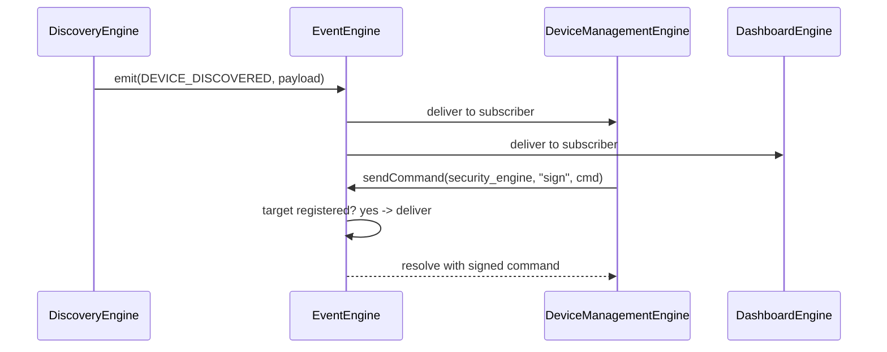
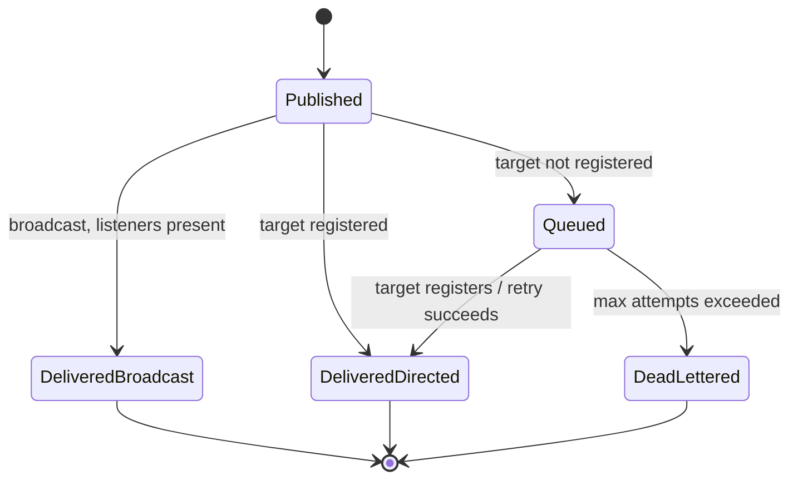

# Event Engine

## 1. Purpose

The Event Engine is the single publish/subscribe backbone every other engine
uses to announce state changes without knowing who — if anyone — is
listening. It is what lets the Discovery Engine tell the Device Management
Engine "I found a device" without either one importing the other.

**Status**: implemented, but as **two parallel buses** today:
`engines/internal-api/message-bus.ts` (`MobileMessageBus`, used by the
gateway for all `EngineId`-addressed engines) and
`src/modules/mqtt/MQTTEvents.ts` (`mqttEvents`, used only within
`modules/mqtt`). This document specifies the unified Event Engine and
documents both existing buses as the two building blocks it wraps.

## 2. Responsibilities

- Deliver typed, named events from any publisher to any number of
  subscribers, in-process, synchronously per listener.
- Provide point-to-point command/response semantics (`sendCommand`) in
  addition to broadcast events (`broadcastMessage`), matching the existing
  gateway's dual mode.
- Queue messages addressed to an engine that isn't currently registered
  (offline queue with exponential backoff — already implemented in
  `MobileMessageBus`), and dead-letter anything that exhausts its retries.
- Keep a bounded ring buffer of recent events per bus (`MQTTEventBus` already
  keeps the last 300) for debugging and for a future developer diagnostics
  panel.
- Isolate listener exceptions so one bad subscriber can't break delivery to
  the others (already true in both existing buses' `try/catch` around each
  listener call).

## 3. Features

- Two delivery modes: **broadcast** (`emit`/`broadcastMessage` — fire to
  every subscriber of an event name) and **directed** (`sendCommand` — to
  exactly one `EngineId`, with a token-authenticated response path).
- Offline queue with exponential backoff for directed messages to an engine
  that isn't registered yet or has gone down (`MobileMessageBus`'s existing
  behavior).
- Dead-letter queue for messages that exceed max retry attempts, so failures
  are inspectable rather than silently dropped.
- Recent-event ring buffer per bus for debugging (`getRecent()` in
  `MQTTEventBus`).
- Per-subscription unsubscribe functions everywhere (`on()` returns
  `() => void`), so no engine ever needs to track its own listener handles
  manually.

## 4. Workflow

1. **Publish**: an engine calls `emit(EVENT_NAME, payload)` (broadcast) or
   `sendCommand(targetEngineId, action, payload)` (directed).
2. **Broadcast delivery**: the bus looks up all listeners registered for
   that event name and invokes each synchronously, catching and logging any
   listener exception without aborting delivery to the rest.
3. **Directed delivery**: the bus looks up the target engine's registration.
   If registered, delivers immediately and (for commands) resolves the
   caller's promise with the response. If not registered, the message is
   pushed onto that engine's offline queue.
4. **Offline queue drain**: when an engine registers (or re-registers after
   a restart), the bus drains its queued messages in order, respecting
   backoff timing already elapsed.
5. **Dead-letter**: a message whose delivery attempts exceed the configured
   max is moved to the dead-letter queue and an event is emitted so a
   diagnostics UI (or the Notification Engine) can surface it.
6. **Recent buffer**: every emitted event (successful or not) is appended to
   the bounded ring buffer regardless of delivery outcome.

## 5. Internal Components

| Component | Responsibility |
|---|---|
| `BroadcastBus` | Named-event pub/sub (wraps today's `MQTTEventBus` pattern) |
| `DirectedRouter` | `EngineId`-addressed command/response delivery (wraps today's gateway `sendCommand`) |
| `OfflineQueueManager` | Per-target backoff queue for undeliverable directed messages |
| `DeadLetterStore` | Messages that exhausted retries |
| `RecentEventRingBuffer` | Bounded history for diagnostics |

## 6. Public APIs

### `on(event: string, listener: (payload: unknown) => void): () => void`
Broadcast subscription. Returns an unsubscribe function.

### `emit(event: string, payload?: unknown): void`
Broadcast publish. Never throws — subscriber exceptions are caught and
logged individually.

### `sendCommand<T>(targetEngineId: EngineId, action: string, payload: unknown): Promise<T>`
Directed, token-authenticated request/response. Queues with backoff if the
target isn't currently registered; rejects if it dead-letters.

### `broadcastMessage(action: string, payload: unknown, excludeEngineId?: EngineId): void`
Directed-shape message delivered to every currently registered engine
except the sender (matches `gateway.broadcastMessage` today).

### `getRecent(limit?: number): EventLogEntry[]`
Returns the most recent events across the unified bus, newest first.

### `getDeadLetters(): DeadLetterEntry[]`
Returns undelivered messages for diagnostics.

## 7. Events

The Event Engine's own meta-events (about the bus itself, distinct from the
domain events every other engine defines):

| Event | Payload | Emitted when |
|---|---|---|
| `MESSAGE_QUEUED` | `{ targetEngineId, action }` | Directed message queued because target is offline |
| `MESSAGE_DEAD_LETTERED` | `{ targetEngineId, action, attempts }` | Max retries exceeded |
| `MESSAGE_DELIVERED` | `{ targetEngineId, action, queuedForMs }` | A previously-queued message finally delivers |

## 8. Database Schema

None — the bus is in-memory only. The offline queue and dead-letter store
are **not** persisted across app restarts by design (they represent
in-flight inter-engine coordination, not durable user data); durable queues
belong to the owning domain engine instead (e.g. the MQTT offline command
queue is persisted by the [Synchronization Engine](SynchronizationEngine.md)
via the [Database Engine](DatabaseEngine.md), not by the Event Engine).

## 9. Local Storage

None owned directly, for the same reason as §8.

## 10. Communication Interfaces

- **Internal only.** The Event Engine is the internal communication
  interface every other engine's "Communication Interfaces" section refers
  back to. It never touches the network.

## 11. Security

- Directed messages carry the sender's gateway-issued token (see
  [SecurityEngine.md](SecurityEngine.md)); the router rejects a
  `sendCommand` from an unregistered or revoked token before it reaches the
  target engine.
- Broadcast events have no sender authentication today — any registered
  engine can `emit()` any event name. This is an accepted current
  limitation (all engines are first-party, bundled code); a future
  dynamically-loaded extension model would need per-event publish ACLs.

## 12. Error Handling

- Listener throws during broadcast delivery → caught and logged per
  listener; delivery continues to remaining listeners (already true in both
  existing buses).
- `sendCommand` to an `EngineId` not present in the manifest at all (typo,
  not just "not started yet") → rejects immediately with
  `UnknownEngineError` rather than queuing forever.
- Queue drain failing for a specific message → attempt count increments,
  message stays queued until max attempts, then dead-letters.

## 13. Recovery Strategy

- Backoff schedule for queued directed messages matches the existing
  MQTT channel backoff shape (`computeBackoffMs` in
  [MQTTCommunicationEngine.md](MQTTCommunicationEngine.md)) for consistency
  across the app: capped exponential with jitter.
- On engine re-registration after a crash/restart, its queue drains
  oldest-first before any new messages addressed to it are delivered, so
  ordering is preserved.

## 14. Future Expansion

- Unify `MobileMessageBus` and `MQTTEventBus` into one implementation behind
  the API in §6 (currently two separate classes with overlapping behavior).
- Per-event publish ACLs once dynamic extensions exist.
- Optional event payload schemas (Zod) validated at `emit()` time in
  development builds only, to catch shape drift early without adding
  runtime cost in production.
- Cross-process event delivery (e.g. a background task posting into the
  foreground app) via a persisted outbox.

## 15. Integration Guide

Every extension in this knowledge base uses the Event Engine as its only
inter-engine channel:
1. On `start()`, register with the gateway to obtain a token and an
   `EngineId` slot in the `DirectedRouter`.
2. Use `on()`/`emit()` for anything other engines might want to react to
   without a direct dependency.
3. Use `sendCommand()` only when you need a response back (e.g. "give me
   current device state"), not for fire-and-forget notifications.
4. Never hold a direct reference to another engine's module — always go
   through this bus, even for engines in the same file tree today.

## 16. Dependencies

None beyond the [Core Engine](CoreEngine.md), which initializes the Event
Engine first, before any other extension starts.

## 17. Sequence Diagram



## 18. State Diagram



## 19. Example API Usage

```ts
import { eventEngine } from "@/core/EventEngine";

// Subscribe
const unsubscribe = eventEngine.on("DEVICE_DISCOVERED", (payload) => {
  console.log("New device:", payload);
});

// Broadcast
eventEngine.emit("DEVICE_DISCOVERED", { deviceId: "esp32-1", ip: "192.168.1.42" });

// Directed request/response
const status = await eventEngine.sendCommand<DeviceStatus>(
  "device_management_engine",
  "GET_DEVICE_STATUS",
  { deviceId: "esp32-1" },
);

unsubscribe();
```

## 20. Extension Registration Process

The Event Engine is foundational infrastructure rather than a consumer
extension, but it still exposes a minimal self-registration for
consistency with the health-monitoring pattern in
[CoreEngine.md](CoreEngine.md):

```ts
gateway.registerEngine(
  {
    id: "event_engine",
    name: "Event Engine",
    version: "1.0.0",
    capabilities: ["pub-sub", "directed-messaging", "offline-queue"],
    subscribedActions: [],
  },
  handleGatewayMessage,
);
```
