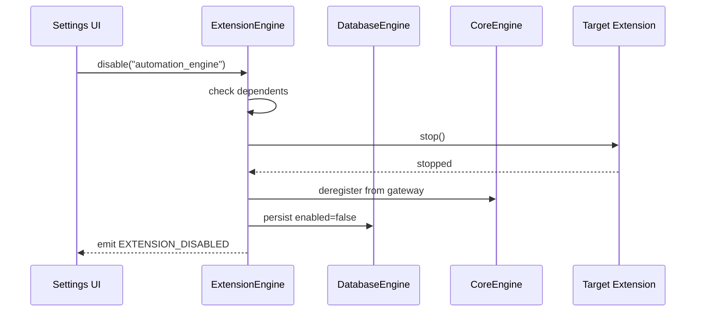
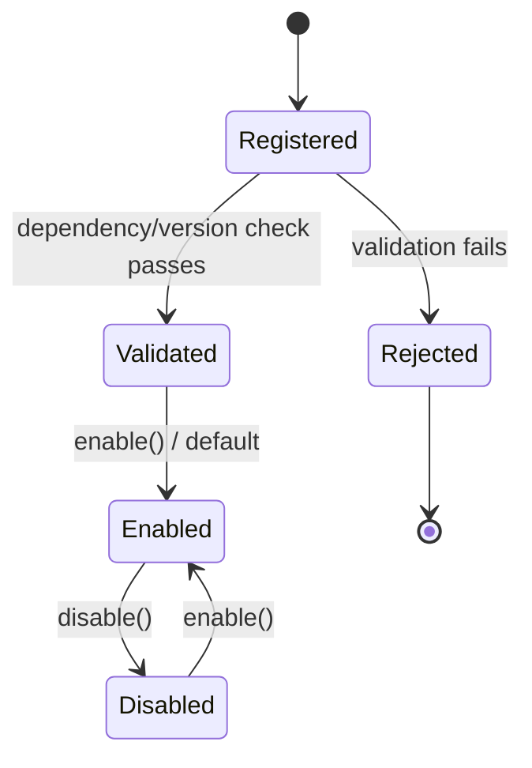

# Extension Engine

## 1. Purpose

The Extension Engine governs the lifecycle of pluggable modules ("engines")
within the Core Engine: installation, versioning, enabling/disabling,
sandboxing, and inter-extension communication policy. It is what turns the
Core Engine from "a fixed list of imports in `engines/index.ts`" into a
genuine plugin system.

**Status**: design spec. No dynamic extension loader exists in the codebase
today — every engine is statically imported and started via
`startAllMobileEngines()`. This document specifies the target shape; the
existing static registration is the migration starting point, not something
to throw away (static-first is safer for a hardware-adjacent app and can
coexist with a future dynamic path).

## 2. Responsibilities

- Maintain the canonical **extension manifest**: id, version, entry point,
  declared capabilities, declared dependencies, enabled/disabled state.
- Enforce that an extension only communicates through the gateway/event bus
  — never via direct imports of another extension's internals.
- Support enabling/disabling an extension at runtime without an app restart
  (stop it, deregister from the gateway, remove its UI surfaces).
- Version-gate extensions: refuse to start an extension whose declared
  `coreVersion` requirement the running Core Engine doesn't satisfy.
- Provide the sandbox boundary for future third-party or dynamically-loaded
  extensions (permissions an extension must declare before it can use, e.g.,
  Bluetooth or storage).

## 3. Features

- Static manifest today (`engines/index.ts` array), addressable at the same
  API surface a dynamic manifest would use, so call sites don't change when
  dynamic loading lands.
- Per-extension enable/disable flag persisted via the
  [Local Database Engine](DatabaseEngine.md) (`extension_state` table).
- Dependency graph validation at manifest-load time: a cycle or a reference
  to an unknown `EngineId` fails fast with a clear error instead of a silent
  hang during boot.
- Capability declarations (e.g. `"bluetooth"`, `"storage"`,
  `"network"`) that the sandbox can check before granting an extension
  access to a shared resource.
- Hot-disable: turning an extension off calls its `stop()`, removes its
  gateway registration, and hides any Dashboard/Settings UI it contributed —
  without restarting the app.

## 4. Workflow

1. **Manifest load**: at Core Engine boot, the Extension Engine reads the
   static manifest (future: also merges any dynamically-installed
   extensions from local storage).
2. **Validation**: dependency graph is checked for cycles/missing nodes;
   version compatibility is checked against `CoreEngine.version`.
3. **Filtering**: extensions flagged `enabled: false` in
   `extension_state` are excluded from the start order.
4. **Handoff**: the validated, ordered list is handed to the Core Engine's
   Bootstrapper (see [CoreEngine.md](CoreEngine.md) §4).
5. **Runtime toggle**: a user (or, later, a remote config flag) disabling an
   extension triggers `ExtensionEngine.disable(id)` → extension `stop()` →
   gateway deregistration → persisted flag flip.
6. **Runtime enable**: `ExtensionEngine.enable(id)` re-validates
   dependencies (all must already be running), then starts the extension
   and registers it against the gateway.

## 5. Internal Components

| Component | Responsibility |
|---|---|
| `ManifestLoader` | Reads static + persisted dynamic manifest entries |
| `DependencyValidator` | Cycle detection, version compatibility checks |
| `ExtensionSandbox` | Capability-gated access to shared resources for each extension |
| `ExtensionStateStore` | Persisted enabled/disabled flags via the Database Engine |

## 6. Public APIs

### `interface Extension`
The contract every engine in this knowledge base implements:
```ts
interface Extension {
  id: EngineId;
  version: string;
  capabilities: string[];
  dependencies: EngineId[];
  start(): Promise<void>;
  stop(): Promise<void>;
}
```

### `register(extension: Extension): void`
Adds an extension to the manifest before boot. Throws
`DuplicateExtensionError` if `id` is already registered.

### `enable(id: EngineId): Promise<void>` / `disable(id: EngineId): Promise<void>`
Runtime toggle described in §4. `disable()` on an extension other engines
depend on throws `ExtensionInUseError` rather than silently breaking its
dependents.

### `getManifest(): ExtensionManifestEntry[]`
Returns the full manifest with resolved enabled/disabled state — used by a
future Settings screen to list installed extensions.

### `hasCapability(id: EngineId, capability: string): boolean`
Sandbox check other engines can call before assuming an extension exposes a
given capability.

## 7. Events

| Event | Payload | Emitted when |
|---|---|---|
| `EXTENSION_REGISTERED` | `{ id: EngineId, version: string }` | `register()` succeeds |
| `EXTENSION_ENABLED` | `{ id: EngineId }` | `enable()` completes |
| `EXTENSION_DISABLED` | `{ id: EngineId }` | `disable()` completes |
| `EXTENSION_VALIDATION_FAILED` | `{ id: EngineId, reason: string }` | Dependency/version check fails |

## 8. Database Schema

`extension_state` (Local Database Engine table):

| Column | Type | Notes |
|---|---|---|
| `extension_id` | text, PK | Matches `EngineId` |
| `enabled` | boolean | Default `true` |
| `installed_version` | text | For future update-diffing |
| `updated_at` | integer (epoch ms) | Last toggle time |

## 9. Local Storage

Persists only the table above. No extension binary/code is stored locally
today (all code ships in the app bundle); a future dynamic-loading design
would add a `extension_bundle` cache keyed by id+version.

## 10. Communication Interfaces

- **Internal**: reads/writes through the Database Engine; emits events via
  the Event Engine. Never calls into an extension's internals — only its
  public `start()`/`stop()`.
- **External**: none today. A future "extension marketplace" would need a
  backend endpoint to fetch manifests, at which point this becomes one of
  the few extensions allowed to talk to the backend directly.

## 11. Security

- Capability declarations are the sandbox boundary: an extension that
  didn't declare `"bluetooth"` cannot successfully call
  `CoreEngine.locate("bluetooth-scan")` — `locate()` checks the caller's
  declared capabilities before returning a handle.
- Static-only loading today means there is no remote-code-execution risk;
  this section becomes load-bearing the moment dynamic/downloaded
  extensions are introduced (code signing + capability review would be
  required before that ships).

## 12. Error Handling

- Duplicate `id` registration → `DuplicateExtensionError`, registration
  rejected, existing extension untouched.
- Dependency cycle detected → boot aborts with the specific cycle path in
  the error message (e.g. `automation_engine → device_engine →
  automation_engine`).
- `disable()` on an in-use dependency → `ExtensionInUseError` listing the
  dependents that would break.

## 13. Recovery Strategy

- A manifest validation failure at boot disables only the offending
  extension (and anything solely depending on it) rather than blocking the
  whole app — matches the Core Engine's "optional extension failure is
  non-fatal" policy.
- Persisted `extension_state` corruption (unreadable/invalid JSON) falls
  back to "all extensions enabled" rather than "all extensions disabled",
  since a fully working app is a safer default than a silently crippled one.

## 14. Future Expansion

- Dynamic extension bundles fetched from the backend's future extension
  registry, with signature verification before load.
- Per-extension permission prompts surfaced to the user (similar to OS
  permission dialogs) the first time an extension requests a sensitive
  capability.
- A Settings → Extensions screen backed directly by `getManifest()`.
- Extension update diffing using `installed_version` vs. a remote manifest.

## 15. Integration Guide

To make an existing module a first-class extension:
1. Wrap its `start`/`stop` in the `Extension` interface shape.
2. List every other `EngineId` it calls through the gateway as a
   `dependencies` entry.
3. Declare `capabilities` truthfully — under-declaring breaks
   `hasCapability()` checks for consumers; over-declaring defeats the
   sandbox.
4. Call `ExtensionEngine.register()` before `CoreEngine.boot()`.

## 16. Dependencies

- [Core Engine](CoreEngine.md) — hands the Extension Engine's validated
  manifest to its Bootstrapper.
- [Local Database Engine](DatabaseEngine.md) — persists enable/disable
  state.
- [Event Engine](EventEngine.md) — emits lifecycle events.

## 17. Sequence Diagram



## 18. State Diagram



## 19. Example API Usage

```ts
import { ExtensionEngine } from "@/core/ExtensionEngine";

ExtensionEngine.register({
  id: "automation_engine",
  version: "1.0.0",
  capabilities: ["automation-eval"],
  dependencies: ["device_management_engine", "event_engine"],
  start: async () => { /* ... */ },
  stop: async () => { /* ... */ },
});

// Later, from a Settings screen
await ExtensionEngine.disable("notification_engine");
const manifest = ExtensionEngine.getManifest();
```

## 20. Extension Registration Process

The Extension Engine registers itself against the gateway like any other
engine, with an elevated capability set since it manages the others:

```ts
gateway.registerEngine(
  {
    id: "extension_engine",
    name: "Extension Engine",
    version: "1.0.0",
    capabilities: ["extension-management", "sandboxing"],
    subscribedActions: [],
  },
  handleGatewayMessage,
);
```

All other engines register with the gateway themselves during `start()`;
the Extension Engine only decides *whether* and *when* that `start()` call
happens.
