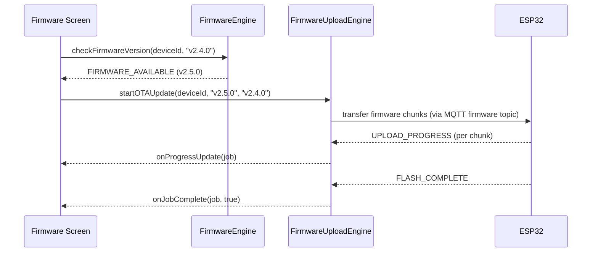
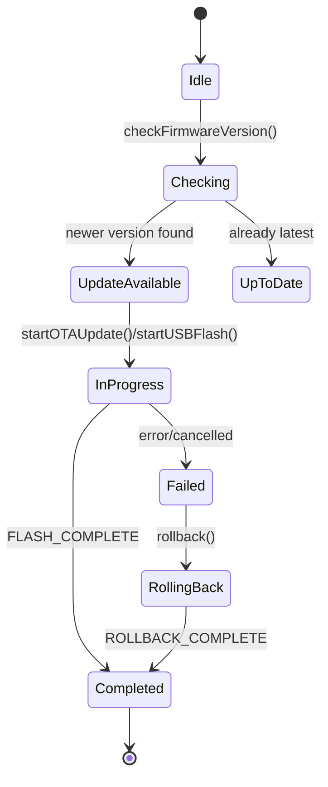

# Firmware Engine

## 1. Purpose

The Firmware Engine manages device firmware from end to end: checking
whether a newer version is available, orchestrating the update job
(over-the-air or via USB), tracking progress, and supporting rollback if an
update goes wrong.

**Status**: implemented across three cooperating gateway engines:
`engines/firmware-engine.ts` (`MobileFirmwareEngine`, `EngineId
"firmware_engine"` — version checks + job tracking),
`engines/firmware-upload-engine.ts` (`MobileFirmwareUploadEngine`,
`EngineId "firmware_upload_engine"` — the actual OTA/USB byte-transfer
jobs, progress, rollback), and `engines/usb-engine.ts` (`MobileUSBEngine` —
serial device detection for the USB path). This document treats all three
as one logical Firmware Engine domain, matching how callers already use
them together.

## 2. Responsibilities

- Check a device's current firmware version against the latest available
  and report whether an update exists.
- Orchestrate OTA updates (wireless, via the
  [MQTT Communication Engine](MQTTCommunicationEngine.md)'s firmware topic)
  and USB updates (wired, via `MobileUSBEngine`'s serial port access).
- Track upload/flash job progress and completion/failure per job, keyed by
  `jobId`.
- Support rollback to a previous version if an update fails validation or
  the user requests it.
- Gate all firmware operations behind
  [Permission Engine](PermissionEngine.md)'s `firmware_update` command,
  which only `owner`/`admin` roles hold.

## 3. Features

- Version check with `CHECK_FIRMWARE_VERSION` request/`FIRMWARE_VERSION_RESULT`
  response cycle.
- Dual update paths: OTA (`startOTAUpdate`) and USB
  (`startUSBFlash(deviceId, version, portPath)`), both producing the same
  `MobileUploadJob` shape so UI doesn't need path-specific rendering logic.
- Job progress tracking (`UPLOAD_PROGRESS`/`FLASH_PROGRESS` →
  `onProgressUpdate` callback) with a 0-100 `progress` field and a
  `status` string.
- Rollback support (`rollback(deviceId, version)`) issued at `"critical"`
  priority on the gateway, reflecting that an in-progress bad update needs
  to preempt other traffic.
- Cancellation (`cancelJob(jobId)`) for an in-progress upload.

## 4. Workflow

1. **Version check**: UI calls `mobileFirmwareEngine.checkFirmwareVersion
   (deviceId, currentVersion)`; the response
   (`FIRMWARE_VERSION_RESULT`) tells the UI whether an update is available.
2. **Update initiation**: user (with `owner`/`admin` role, checked by
   [Permission Engine](PermissionEngine.md) before this call is even
   exposed in the UI) triggers `startOTAUpdate` or `startUSBFlash` on
   `mobileFirmwareUploadEngine`.
3. **USB path specifics**: `MobileUSBEngine` first detects/opens the serial
   port (`portPath`) before the upload engine begins the byte transfer.
4. **Progress**: `UPLOAD_PROGRESS`/`FLASH_PROGRESS` messages update the
   job's `progress`/`status` fields; `onProgressUpdate` fires for each
   update so the UI can render a progress bar.
5. **Completion**: `ROLLBACK_COMPLETE`/`FLASH_COMPLETE` mark the job
   `done` at 100% and fire `onJobComplete(job, success)`.
6. **Rollback**: if the device reports a failed boot on the new version (or
   the user manually requests it), `rollback()` is issued at critical
   priority; on completion `MobileFirmwareEngine`'s own job map also
   reflects the rollback via `FIRMWARE_UPDATED`/`ROLLBACK_COMPLETE`.

## 5. Internal Components

| Component | File | Responsibility |
|---|---|---|
| `MobileFirmwareEngine` | `firmware-engine.ts` | Version checks, high-level job registry |
| `MobileFirmwareUploadEngine` | `firmware-upload-engine.ts` | OTA/USB byte transfer, progress, rollback |
| `MobileUSBEngine` | `usb-engine.ts` | Serial port detection/open for the USB path |

## 6. Public APIs

### `checkFirmwareVersion(deviceId: string, currentVersion: string): void`
Requests a version comparison against the latest available.

### `requestUpdate(deviceId: string, targetVersion: string): void`
Requests an update be scheduled (higher-level than starting the byte
transfer directly).

### `startOTAUpdate(deviceId: string, version: string, currentVersion?: string): void`
Begins a wireless firmware update.

### `startUSBFlash(deviceId: string, version: string, portPath: string): void`
Begins a wired firmware update over a specific serial port.

### `rollback(deviceId: string, version: string): void`
Requests reversion to a prior version, issued at `"critical"` priority.

### `cancelJob(jobId: string): void`
Cancels an in-progress job.

### `getJobs(): UpdateJob[] | MobileUploadJob[]`
Returns all tracked jobs for a status/history UI.

## 7. Events

| Event | Payload | Emitted when |
|---|---|---|
| `FIRMWARE_VERSION_RESULT` | version comparison | Response to a version check |
| `FIRMWARE_AVAILABLE` | `{ deviceId, version }` | A newer version is found |
| `UPLOAD_PROGRESS` / `FLASH_PROGRESS` | `MobileUploadJob` | Byte-transfer progress update |
| `FIRMWARE_UPDATED` / `FLASH_COMPLETE` | job payload | Update finishes successfully |
| `ROLLBACK_COMPLETE` | job payload | Rollback finishes |

## 8. Database Schema

Via the [Database Engine](DatabaseEngine.md): `firmware_jobs` (jobId,
deviceId, targetVersion, method, status, progress, startedAt, completedAt)
for history/audit; `firmware_versions` (deviceId, version, checksum,
releaseDate, stable) as a local cache of what's been checked. Not persisted
today — job maps are in-memory `Map`s that reset on app restart.

## 9. Local Storage

None today. Spec target: persist completed job history so a user can see
"last updated on [date] to vX.Y.Z" even after an app restart.

## 10. Communication Interfaces

- **Internal**: [Permission Engine](PermissionEngine.md) (role gating
  before any firmware UI action is exposed), [MQTT Communication Engine](MQTTCommunicationEngine.md)
  (OTA transfer over the device's `firmware` topic), `MobileUSBEngine`
  (serial transport for the wired path), [Notification Engine](NotificationEngine.md)
  (update available / complete / failed notifications).
- **External**: a firmware binary repository is expected to live on the
  backend (hosting binaries, checksums, changelogs, signing) — not
  implemented in this mobile codebase; the mobile engines here consume
  whatever `FIRMWARE_VERSION_RESULT` reports without knowing where the
  binary physically comes from.

## 11. Security

- Firmware operations require `owner`/`admin` role
  ([Permission Engine](PermissionEngine.md)'s `firmware_update` gate) — no
  other role can trigger, cancel, or roll back an update.
- Rollback is issued at `"critical"` gateway priority so it can preempt
  routine traffic — a stuck bad-firmware device shouldn't wait behind a
  queue of brightness commands.
- Binary integrity verification (checksum match before flashing) is a
  device-firmware-side responsibility; the mobile engine's role is to
  transport the binary and trust the checksum the version-check step
  reported, not to independently verify it today.

## 12. Error Handling

- Update job stalls (no progress event within an expected window) → spec
  target: surfaced as a `FIRMWARE_UPDATE_STALLED` event so the UI can offer
  cancel/retry rather than showing a progress bar frozen forever.
- USB port open failure (`MobileUSBEngine`) → the upload job never starts;
  reported distinctly from an in-progress flash failure so the user knows
  to check the cable/port rather than assuming the update itself failed.
- Rollback request for a version that was never successfully applied →
  rejected before dispatch (no prior successful job for that device/version
  pair).

## 13. Recovery Strategy

- A failed OTA update (checksum mismatch, device reports boot failure)
  should auto-trigger the device's own bootloader rollback where the
  firmware supports it; the mobile engine's `rollback()` call is the
  manual/explicit path for cases where that doesn't happen automatically.
- Cancelled or failed jobs remain in `getJobs()` (not silently removed) so
  the user can see the failure and retry deliberately.

## 14. Future Expansion

- Persist job history (see §9).
- Staged/canary rollout coordination for multiple devices of the same
  model, driven from the backend's firmware repository.
- Automatic checksum verification on the mobile side before starting a
  flash, not just trusting the version-check response.
- Delta/incremental OTA updates instead of full-binary transfer.

## 15. Integration Guide

To add support for a new device model's firmware format:
1. The version-check and job-tracking contract (`UpdateJob`/
   `MobileUploadJob`) is model-agnostic — no changes needed there.
2. Only the actual byte-transfer implementation inside
   `MobileFirmwareUploadEngine`'s OTA/USB handlers needs model-specific
   logic (e.g. a different chunk size or handshake).
3. Always gate the new path behind the same `firmware_update` permission
   check — never add a firmware action that bypasses
   [PermissionEngine.md](PermissionEngine.md).

## 16. Dependencies

[Permission Engine](PermissionEngine.md),
[MQTT Communication Engine](MQTTCommunicationEngine.md) (OTA transport),
[Event Engine](EventEngine.md), [Notification Engine](NotificationEngine.md),
[Database Engine](DatabaseEngine.md) (future job history persistence).

## 17. Sequence Diagram



## 18. State Diagram



## 19. Example API Usage

```ts
import { mobileFirmwareEngine } from "@/engines/firmware-engine";
import { mobileFirmwareUploadEngine } from "@/engines/firmware-upload-engine";

mobileFirmwareEngine.checkFirmwareVersion("L001", "v2.4.1");

mobileFirmwareUploadEngine.onProgressUpdate((job) => {
  console.log(`${job.deviceId}: ${job.progress}%`);
});
mobileFirmwareUploadEngine.onJobComplete((job, success) => {
  console.log(`${job.deviceId} update ${success ? "succeeded" : "failed"}`);
});

mobileFirmwareUploadEngine.startOTAUpdate("L001", "v2.5.0", "v2.4.1");
```

## 20. Extension Registration Process

```ts
gateway.registerEngine(
  {
    id: "firmware_engine",
    name: "Firmware Engine",
    version: "1.0.0",
    capabilities: ["firmware_management", "version_checking", "ota_coordination"],
    subscribedActions: [
      "FIRMWARE_VERSION_RESULT",
      "FIRMWARE_VALIDATION_RESULT",
      "FIRMWARE_STATUS",
      "FIRMWARE_UPDATED",
      "UPLOAD_PROGRESS",
      "ROLLBACK_COMPLETE",
    ],
  },
  handleGatewayMessage,
);

gateway.registerEngine(
  {
    id: "firmware_upload_engine",
    name: "Firmware Upload Engine",
    version: "1.0.0",
    capabilities: ["ota_upload", "usb_flashing", "firmware_verification", "upload_progress", "rollback_support"],
    subscribedActions: ["UPLOAD_PROGRESS", "UPLOAD_STATUS", "ROLLBACK_COMPLETE", "FLASH_PROGRESS", "FLASH_COMPLETE"],
  },
  handleGatewayMessage,
);
```
