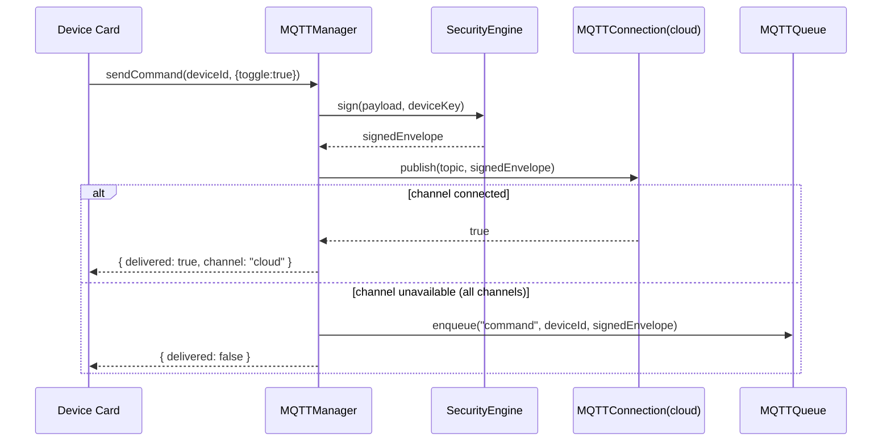
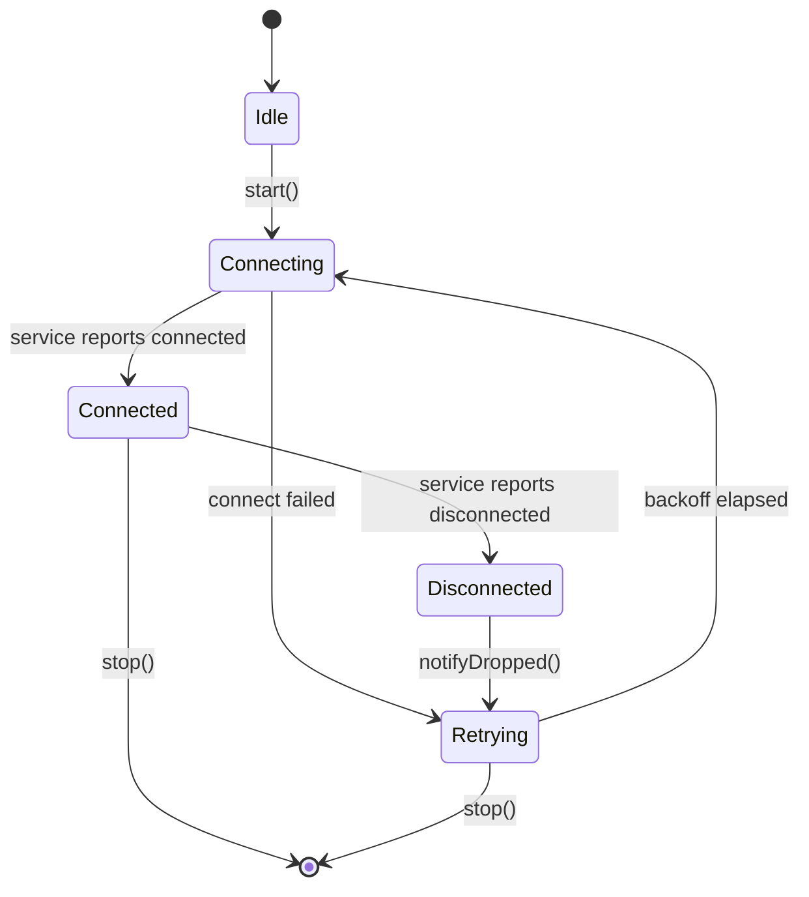

# MQTT Communication Engine

## 1. Purpose

The MQTT Communication Engine is the transport layer that carries every
device command, status update, and event between the phone and ESP32
devices. It abstracts three concerns behind one interface: which channel is
currently reachable (cloud broker, local/LAN broker, or a direct ESP32
connection), whether the real native MQTT session or a simulated fallback is
in use, and what to do with a command when nothing is reachable at all.

**Status**: implemented. Lives in `src/modules/mqtt/*` plus
`engines/mqtt-client-engine.ts` (`mobileRNMQTTClientEngine`, registered on
the gateway as `EngineId "rn_mqtt_client_engine"`).

## 2. Responsibilities

- Maintain up to three independent named channels — `cloud`, `local`,
  `esp32_direct` — each with its own connection lifecycle, priority, and
  metrics (`MQTTConnection`).
- Fail over between channels by priority, and ultimately to the
  [Bluetooth Engine](BluetoothEngine.md)'s mesh transport, before finally
  queuing offline (`MQTTManager`'s channel failover chain).
- Own the canonical topic scheme for every device
  (`device/{deviceId}/{kind}` — `MQTTTopics.ts`).
- Sign outgoing commands when a device key is available, delegating the
  actual signing to the [Security Engine](SecurityEngine.md)
  (`MQTTSecurity.ts`).
- Reconnect with backoff per channel (`MQTTRecovery.ts`'s
  `ReconnectSupervisor`) and trigger reconciliation
  ([Synchronization Engine](SynchronizationEngine.md)) once a channel comes
  back.
- Report every lifecycle transition on a dedicated, typed event bus
  (`MQTTEvents.ts`) so UI never has to know which channel/transport is
  active.

## 3. Features

- **Channel failover chain**: cloud → local → HTTP fallback → Bluetooth mesh
  (via the P2P/Bluetooth Engine) → offline queue. Each hop is only taken if
  the previous one is unavailable, not on every send.
- **Dual transport per channel**: `MQTTService.ts` picks a real
  `NativeMQTTService` (backed by `@arduino/react-native-mqtt-client`) when
  the native module is autolinked, or a `SimulatedMQTTService` (backed by
  the existing gateway's `mobileRNMQTTClientEngine`) otherwise — and the
  very first fallback use fires `NATIVE_TRANSPORT_UNAVAILABLE` so the UI can
  show an honest "simulated" badge instead of pretending.
  ⚠️ Native modules cannot load inside Expo Go; only a custom dev client
  build activates the real path.
- **Ten canonical topics per device**: `status`, `command`, `response`,
  `event`, `firmware`, `schedule`, `permission`, `heartbeat`, `logs`,
  `sync` — always produced via `buildTopics()`/`topicFor()`, never
  hand-built.
- **Per-channel metrics**: latency, last-message time, reconnect attempts,
  messages/minute (`ChannelMetrics` in `MQTTConnection`).
- **Command signing**: commands are signed when a device key exists;
  unsigned commands are still sent but flagged, matching the project's
  honesty convention around simulated/partial security.

## 4. Workflow

1. **Connect**: `MQTTManager` starts all configured channels; each
   `MQTTConnection` hands its `ReconnectSupervisor` a `connectFn` and starts
   it immediately.
2. **Publish**: caller asks `MQTTManager` to send a command for a device.
   The manager resolves the topic via `MQTTTopics`, optionally signs the
   payload via the Security Engine, and attempts publish on the
   highest-priority connected channel.
3. **Failover**: if the top channel can't publish (not connected), the
   manager tries the next channel in priority order, then HTTP, then the
   Bluetooth mesh, before finally calling `MQTTQueue.enqueue()`.
4. **Receive**: each `MQTTConnection` subscribes to a device's topic
   wildcard; incoming messages are parsed via `parseTopic()` and routed to
   the relevant module (status → device cache, event → `MQTTEvents`,
   firmware → Firmware Engine).
5. **Disconnect/reconnect**: `service.onDisconnected()` calls
   `supervisor.notifyDropped()`, which schedules a backoff retry; a
   successful reconnect fires `onReconnected`, which triggers
   [MQTTSync.ts's `syncAll`](SynchronizationEngine.md) and then
   `MQTTQueue.drain()`.
6. **Discovery hookup**: newly discovered devices
   ([DiscoveryEngine.md](DiscoveryEngine.md)) are auto-registered via
   [MQTTPermissions.ts](PermissionEngine.md)'s `registerDevice`.

## 5. Internal Components

| Component | File | Responsibility |
|---|---|---|
| `MQTTManager` | `MQTTManager.ts` | Orchestrates channel failover + signing |
| `MQTTConnection` | `MQTTConnection.ts` | One named channel's connection lifecycle + metrics |
| `MQTTService` (Native/Simulated) | `MQTTService.ts` | Transport boundary; hides native vs. simulated |
| `MQTTTopics` | `MQTTTopics.ts` | Canonical topic construction/parsing |
| `ReconnectSupervisor` | `MQTTRecovery.ts` | Per-channel backoff + reconnect |
| `mobileRNMQTTClientEngine` | `engines/mqtt-client-engine.ts` | Gateway-registered simulated MQTT bus used by `SimulatedMQTTService` |

## 6. Public APIs

### `MQTTManager.connect(): Promise<void>`
Starts all configured channels.

### `MQTTManager.sendCommand(deviceId: string, command: Record<string, unknown>): Promise<{ delivered: boolean; channel?: ChannelId }>`
Attempts the full failover chain; queues offline if nothing succeeds.

### `MQTTConnection.publish(topic: string, payload: Record<string, unknown>): Promise<boolean>`
Low-level publish on one specific channel.

### `MQTTConnection.subscribe(topic: string, handler: IncomingHandler): Promise<() => void>`
Subscribes on one channel; returns an unsubscribe function.

### `buildTopics(deviceId: string): DeviceTopics` / `parseTopic(topic: string): ParsedTopic | null`
Topic construction/parsing — the only sanctioned way to produce or read a
topic string.

### `isNativeMqttAvailable(): boolean`
Reports whether the real native module is currently autolinked.

## 7. Events

All emitted on the shared `mqttEvents` bus (`MQTT_EVENT` in
`MQTTEvents.ts`), which the [Event Engine](EventEngine.md) unifies with the
gateway bus going forward:

`DEVICE_CONNECTED`, `DEVICE_DISCONNECTED`, `BROKER_CONNECTED`,
`BROKER_DISCONNECTED`, `COMMAND_SENT`, `COMMAND_RECEIVED`,
`COMMAND_QUEUED`, `CHANNEL_FAILOVER`, `STATUS_CHANGED`,
`SECURITY_VIOLATION`, `NATIVE_TRANSPORT_UNAVAILABLE`.

## 8. Database Schema

No relational schema — persisted via the [Database Engine](DatabaseEngine.md)
(currently `MQTTStorage.ts`'s AsyncStorage keys): `sessions` (one per
`ChannelId`, last broker URL + connected time).

## 9. Local Storage

`MQTTStorage.ts` keys relevant to this engine: session metadata per channel
(`clientId`, `brokerUrl`, `lastConnectedAt`). Offline queue and device cache
are documented under the [Synchronization Engine](SynchronizationEngine.md)
since they're shared with reconciliation, not MQTT-specific state.

## 10. Communication Interfaces

- **Internal**: [Security Engine](SecurityEngine.md) (signing),
  [Permission Engine](PermissionEngine.md) (device registration/role
  gating), [Synchronization Engine](SynchronizationEngine.md) (post-reconnect
  reconciliation + offline queue), [Discovery Engine](DiscoveryEngine.md)
  (new-device hookup), [Bluetooth Engine](BluetoothEngine.md) (mesh
  fallback channel).
- **External**: cloud MQTT broker (backend-provided), local LAN broker,
  direct ESP32 broker connection; HTTP fallback endpoint on the backend API
  server.

## 11. Security

- Commands are signed via the Security Engine before publish whenever a
  device key exists (see [SecurityEngine.md](SecurityEngine.md) for the
  signing scheme — explicitly documented there as keyed-hash, not real
  HMAC).
- `SECURITY_VIOLATION` fires on transport-level errors from the native/
  simulated service (`service.onError`), which the Notification/Dashboard
  Engines can surface to the user.
- TLS is supported (`useTls` in `ConnectParams`) for the native transport;
  the simulated transport has no real network layer to secure.

## 12. Error Handling

- Publish on a disconnected channel returns `false` rather than throwing —
  callers use the boolean to decide on failover.
- `service.connect()` throwing is caught inside `MQTTConnection.doConnect`
  and reported to the `ReconnectSupervisor` as a failed attempt, not
  propagated up.
- Malformed inbound JSON payload → `MQTTService` falls back to
  `{ raw: <string> }` rather than dropping the message silently.

## 13. Recovery Strategy

- Per-channel exponential backoff with ±15% jitter, capped at 30s
  (`computeBackoffMs` — shared shape referenced by
  [EventEngine.md](EventEngine.md) for consistency).
- On reconnect, `onReconnected` triggers sync-then-drain in that order so a
  duplicate retained message can't be double-applied ahead of the version
  check in `MQTTSync`.
- Failover to Bluetooth mesh is itself resilient — the mesh's own
  store-and-forward (see [BluetoothEngine.md](BluetoothEngine.md)) keeps
  retrying independently of the MQTT reconnect loop.

## 14. Future Expansion

- Real HMAC-SHA256 signing once a proper crypto library replaces the
  documented keyed-hash placeholder.
- QoS-aware publish (retry-until-ack) rather than the current fire-and-check
  boolean result.
- Per-topic access control enforced at the broker in addition to the
  client-side role gating in the Permission Engine.
- Metrics export to the backend for fleet-wide connectivity dashboards.

## 15. Integration Guide

To add a new device-facing feature that needs wire transport:
1. Add a new `TopicKind` to `MQTTTopics.ts` if the feature needs a new
   topic — never hand-build a topic string elsewhere.
2. Route the payload as an event through `MQTTEvents`, not by importing
   `MQTTManager` internals directly from UI code.
3. If the feature needs role gating, add the command to
   [PermissionEngine.md](PermissionEngine.md)'s `GatedCommand` union first.

## 16. Dependencies

[Security Engine](SecurityEngine.md), [Permission Engine](PermissionEngine.md),
[Synchronization Engine](SynchronizationEngine.md),
[Discovery Engine](DiscoveryEngine.md), [Event Engine](EventEngine.md),
[Bluetooth Engine](BluetoothEngine.md) (fallback transport).

## 17. Sequence Diagram



## 18. State Diagram



## 19. Example API Usage

```ts
import { mqttManager } from "@/modules/mqtt/MQTTManager";

await mqttManager.connect();

const result = await mqttManager.sendCommand("esp32-lamp-1", {
  type: "toggle",
  value: true,
});

if (!result.delivered) {
  console.log("Queued offline — will retry once a channel reconnects");
}
```

## 20. Extension Registration Process

```ts
gateway.registerEngine(
  {
    id: "rn_mqtt_client_engine",
    name: "MQTT Communication Engine",
    version: "1.0.0",
    capabilities: ["device-command", "device-status", "pub-sub-transport"],
    subscribedActions: ["SEND_DEVICE_COMMAND", "SUBSCRIBE_DEVICE_TOPIC"],
  },
  handleGatewayMessage,
);
```
