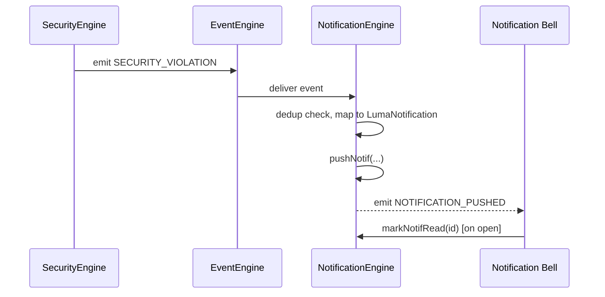
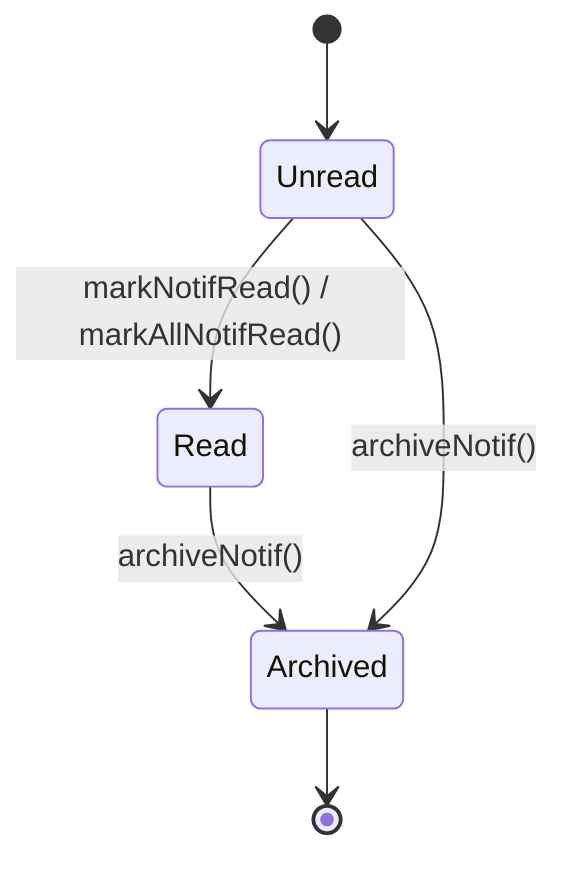

# Notification Engine

## 1. Purpose

The Notification Engine is the single place an in-app alert originates
from — a firmware update available, a permission request pending, a
security violation, a device going offline. It decouples "something
happened that the user should know about" from "how it's displayed,"
so any engine can raise a notification without owning UI logic.

**Status**: implemented as UI-layer state.
`context/LumaContext.tsx` holds `notifications: LumaNotification[]` with
`pushNotif`, `markAllNotifRead`, `archiveNotif`, `markNotifRead`. This
document specifies the Notification Engine as the gateway-integrated
extraction of that logic — the existing `LumaNotification` shape
(`data/luma-data.ts`) is the reference data model to keep.

## 2. Responsibilities

- Accept notification requests from any other engine via the
  [Event Engine](EventEngine.md) and append them to the notification feed.
- Track read/unread and archived state per notification.
- Provide the feed to the UI (notification bell/list) as a single
  subscribed source of truth, rather than each screen tracking its own
  copy.
- Avoid duplicate/noisy notifications for the same underlying condition
  (e.g. don't push a new "device offline" notification every few seconds
  while it stays offline).

## 3. Features

- Category tagging (`LumaNotification.cat`) and icon per notification, so
  the feed can be filtered/grouped by type (device, security, firmware,
  access-request, etc.).
- Read/unread state with `markNotifRead`/`markAllNotifRead`.
- Archive (soft-delete) via `archiveNotif` — archived notifications leave
  the active feed but aren't permanently deleted, matching the existing
  `archived: boolean` field rather than a hard delete.
- Auto-incrementing local id assignment (`notifIdRef`) so callers never
  need to generate ids themselves.

## 4. Workflow

1. **Raise**: any engine (Security, Permission, Firmware, Discovery, etc.)
   emits a domain event; the Notification Engine's subscription list maps
   specific events to a `pushNotif()` call with an appropriate category/
   icon/title.
2. **Dedup check**: before pushing, the engine checks whether an
   unarchived, unread notification for the same source+category already
   exists within a short window; if so, it updates that entry's timestamp
   instead of adding a duplicate.
3. **Feed update**: `pushNotif` prepends the new notification (newest
   first) to the `notifications` array with `read: false, archived: false`.
4. **User interaction**: opening the notification feed calls
   `markAllNotifRead` (or `markNotifRead` for a single item); dismissing
   one calls `archiveNotif`.
5. **Consumption**: UI subscribes to the notification list via context/
   the Event Engine, re-rendering the bell badge count from the
   unread-and-unarchived subset.

## 5. Internal Components

| Component | Responsibility |
|---|---|
| `NotificationFeed` (spec target, currently `LumaContext` state) | Ordered list of notifications |
| `EventToNotificationMapper` | Maps specific domain events to notification content |
| `DedupGuard` | Prevents repeated notifications for an unresolved condition |
| `ReadStateTracker` | Read/unread/archived bookkeeping |

## 6. Public APIs

### `pushNotif(notif: Omit<LumaNotification, "id" | "read" | "archived">): void`
Adds a new notification (existing `LumaContext` method).

### `markNotifRead(id: number): void` / `markAllNotifRead(): void`
Marks one or all notifications read.

### `archiveNotif(id: number): void`
Soft-deletes a notification from the active feed.

### `getUnreadCount(): number` (spec target)
Returns the count for a badge indicator, derived from the feed rather than
tracked separately (avoids the two ever drifting apart).

```ts
interface LumaNotification {
  id: number;
  cat: string;
  icon: string;
  title: string;
  time: string;
  read: boolean;
  archived: boolean;
}
```

## 7. Events

| Event | Payload | Emitted when |
|---|---|---|
| `NOTIFICATION_PUSHED` | `LumaNotification` | `pushNotif` adds a new entry |
| `NOTIFICATION_READ` | `{ id }` | `markNotifRead` |
| `NOTIFICATION_ALL_READ` | `{}` | `markAllNotifRead` |
| `NOTIFICATION_ARCHIVED` | `{ id }` | `archiveNotif` |

Consumed events (spec target — sources that should feed this engine):
`SECURITY_VIOLATION`, `USER_REQUEST_RECEIVED`, `FIRMWARE_AVAILABLE`,
`DEVICE_COMMAND_FAILED`, `AUTOMATION_CONFLICT_RESOLVED`,
`NATIVE_TRANSPORT_UNAVAILABLE`.

## 8. Database Schema

Via the [Database Engine](DatabaseEngine.md): `notifications` (id, cat,
icon, title, time, read, archived). Not persisted today — resets on app
restart, which loses notification history across sessions.

## 9. Local Storage

None today. Spec target: persist so a user reopening the app still sees
notifications raised while it was closed/backgrounded.

## 10. Communication Interfaces

- **Internal**: consumes events from essentially every other engine (see
  §7); no other engine should read `LumaContext`'s notification state
  directly — they should only emit the source event and let this engine's
  mapper decide what to push.
- **External**: none today. Spec target: integrate with OS-level push
  notifications (via a backend push-dispatch service, since native push
  requires a server-side sender) for alerts that matter while the app is
  fully closed — explicitly a backend responsibility per this project's
  mobile/backend split (see [README.md](README.md)).

## 11. Security

- Notifications must never include plaintext keys/credentials in their
  `title` or any other field, even for security-related events — a
  `SECURITY_VIOLATION` notification should describe *that* something
  happened, not echo the sensitive payload that triggered it.
- Only the affected user's own notifications are shown; there's no
  cross-user notification visibility (each phone/session has its own feed
  today, consistent with `LumaContext` being unauthenticated per-session
  state).

## 12. Error Handling

- `pushNotif` called with a malformed/missing required field → the engine
  fills safe defaults (generic icon/category) rather than dropping the
  notification silently — the user should still know *something* happened
  even if the source event was malformed.
- Duplicate rapid-fire events (e.g. a flapping connection) → collapsed by
  the `DedupGuard` rather than flooding the feed.

## 13. Recovery Strategy

- No special recovery needed beyond standard persistence (§14) — the feed
  is additive and doesn't depend on any external connection to function.

## 14. Future Expansion

- Persist notification history (see §9).
- OS-level push notification integration via the backend.
- Per-category mute/preferences (e.g. suppress `firmware_available` pushes
  but keep `security_violation`).
- Notification grouping (e.g. collapse "5 devices went offline" into one
  entry instead of 5).

## 15. Integration Guide

Any engine that wants to notify the user:
1. Emit a specific, well-named domain event via the
   [Event Engine](EventEngine.md) — do not call `pushNotif()` directly from
   unrelated engines; keep the event→notification mapping centralized here
   so copy/icon/category stay consistent.
2. If a new event type needs user-facing notification, add it to the
   `EventToNotificationMapper`'s table rather than special-casing it in the
   source engine.

## 16. Dependencies

[Event Engine](EventEngine.md), [Database Engine](DatabaseEngine.md)
(future persistence).

## 17. Sequence Diagram



## 18. State Diagram



## 19. Example API Usage

```ts
import { useLuma } from "@/context/LumaContext";

const { notifications, pushNotif, markAllNotifRead, archiveNotif } = useLuma();

pushNotif({
  cat: "security",
  icon: "shield-alert",
  title: "Signature mismatch detected on Living Room Main",
  time: "just now",
});

const unreadCount = notifications.filter((n) => !n.read && !n.archived).length;
```

## 20. Extension Registration Process

```ts
gateway.registerEngine(
  {
    id: "notification_engine",
    name: "Notification Engine",
    version: "1.0.0",
    capabilities: ["notification-feed", "event-to-alert-mapping"],
    subscribedActions: [
      "SECURITY_VIOLATION",
      "USER_REQUEST_RECEIVED",
      "FIRMWARE_AVAILABLE",
      "DEVICE_COMMAND_FAILED",
      "AUTOMATION_CONFLICT_RESOLVED",
      "NATIVE_TRANSPORT_UNAVAILABLE",
    ],
  },
  handleGatewayMessage,
);
```
