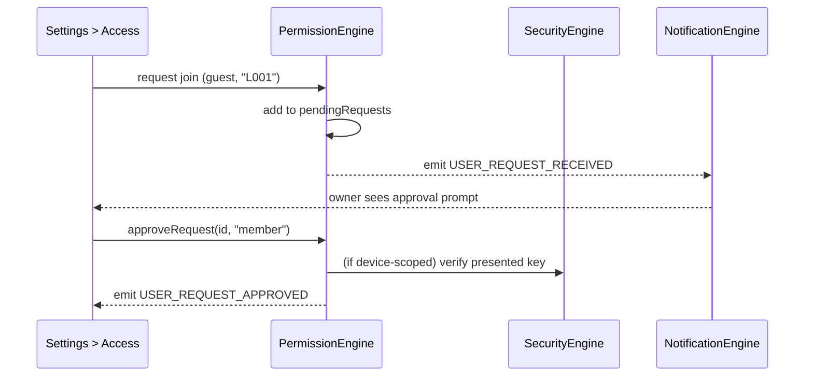
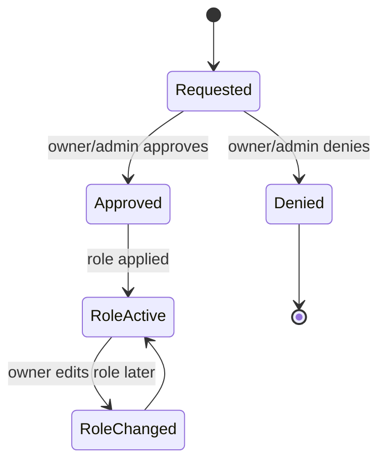

# Permission Engine

## 1. Purpose

The Permission Engine decides who is allowed to do what. It is the single
role-based access control point in the app: every command that reaches a
device, and every sensitive UI action (inviting a user, approving a guest
request, editing schedules), is checked here before it executes.

**Status**: implemented, scoped to device commands
(`src/modules/mqtt/MQTTPermissions.ts`), plus a parallel user/role and
pending-request model in `context/LumaContext.tsx` (`users`,
`pendingRequests`, `approvedRequests`). This document specifies the unified
Permission Engine covering both device-command gating and app-level user
role management.

## 2. Responsibilities

- Define the role hierarchy (`owner` > `admin` > `member` > `guest`) and
  which device commands each role may issue.
- Register new devices with owner/admin/registration keys
  (delegating key generation/hashing to the
  [Security Engine](SecurityEngine.md)).
- Verify a presented key against a device's registered keys for
  privilege-elevation flows (e.g. a guest claiming an owner key to become
  an admin on that device).
- Manage the household's user list and each user's role, plus the
  request/approval flow for a new person joining (`pendingRequests` →
  `approvedRequests`).
- Provide the single `canPerform`/`canControlDevice` gate every other
  engine calls before acting on a role-sensitive request.

## 3. Features

- Role → allowed-command matrix (`ROLE_ALLOWLIST`): owners/admins get
  firmware, reboot, schedule, and (owner-only) permission-write and
  factory-reset; members get schedules plus basic control; guests get only
  toggle/brightness.
- Device registration mints three distinct keys (owner/admin/registration)
  so a device can be handed to a different trust level of user without
  reusing the same credential.
- Pending-request workflow: a new user's join/elevation request sits in
  `pendingRequests` until an owner/admin approves or denies it, then moves
  to `approvedRequests` (or is discarded) — mirrors a lightweight household
  admission control flow.
- Combined check helper (`canControlDevice`) returns both a boolean and a
  human-readable reason, so UI can show *why* an action is blocked instead
  of just hiding the button silently.

## 4. Workflow

1. **Device registration**: [Discovery Engine](DiscoveryEngine.md) or a
   manual pairing flow calls `registerDevice(deviceId, mac)`. The Permission
   Engine asks the Security Engine to generate and hash three keys, persists
   the registry entry, and returns the plaintext keys once for the caller
   to distribute.
2. **Command gating**: before [Device Management Engine](DeviceManagementEngine.md)
   dispatches any command, it calls `canControlDevice(role, command)`. A
   `false` result blocks dispatch entirely — the command never reaches the
   transport layer.
3. **Key verification**: a user presenting a plaintext key (e.g. scanning a
   QR code to claim admin rights on a device) has that key hashed and
   compared against the stored hash for the claimed key type.
4. **User join request**: a new user requesting access is added to
   `pendingRequests`; an owner/admin reviewing the request moves it to
   `approvedRequests` (granting a role) or discards it.
5. **Role change**: an owner can change any existing user's role at any
   time; the change takes effect on the next command check (no caching of
   stale roles beyond the current session's user object).

## 5. Internal Components

| Component | Responsibility |
|---|---|
| `RoleAllowlist` | Static role → command matrix |
| `DeviceRegistrar` | Registers devices, mints/persists key hashes |
| `KeyVerifier` | Verifies presented keys against stored hashes |
| `UserDirectory` (spec target, currently `LumaContext` state) | Household user list + roles |
| `RequestQueue` (spec target, currently `LumaContext` state) | Pending join/elevation requests |

## 6. Public APIs

### `canPerform(role: LumaRole, command: GatedCommand): boolean`
Pure allowlist check.

### `canControlDevice(role: LumaRole, command: GatedCommand): { allowed: boolean; reason?: string }`
Combined check with a human-readable reason on denial — the call site every
other engine should use.

### `registerDevice(deviceId: string, mac: string): Promise<DeviceRegistrationResult>`
Mints and persists owner/admin/registration key hashes; returns plaintext
once.

### `verifyDeviceKey(deviceId: string, key: string, keyType: KeyType): Promise<boolean>`
Verifies a presented key against the stored hash.

### `isDeviceRegistered(deviceId: string): Promise<boolean>`
Existence check used by Discovery to decide whether to auto-register.

### `approveRequest(requestId: number, role: LumaRole): void` / `denyRequest(requestId: number): void` (spec target)
Moves a pending request to approved (with an assigned role) or discards it.

## 7. Events

| Event | Payload | Emitted when |
|---|---|---|
| `DEVICE_REGISTERED` | `{ deviceId, mac }` | New device registered |
| `PERMISSION_DENIED` | `{ role, command, reason }` | `canControlDevice` returns `false` |
| `USER_REQUEST_RECEIVED` | `PendingRequest` | A new join/elevation request arrives |
| `USER_REQUEST_APPROVED` / `USER_REQUEST_DENIED` | `{ requestId }` | Request resolved |
| `ROLE_CHANGED` | `{ userId, oldRole, newRole }` | An owner changes a user's role |

## 8. Database Schema

Via the [Database Engine](DatabaseEngine.md): `device_registry` (mirrors
`DeviceRegistryEntry`), `users` (id, name, role), `access_requests` (id,
user, requested role/device, status, timestamp). Users/requests are
in-memory only today (`LumaContext`); the device registry is already
persisted via `MQTTStorage.ts`.

## 9. Local Storage

Current: AsyncStorage `device_registry` key (hashed keys only). User/role
and request state is not persisted today — resets on app restart, which is
a known gap for a genuinely multi-session household app.

## 10. Communication Interfaces

- **Internal**: [Security Engine](SecurityEngine.md) (key generation/
  hashing), [Device Management Engine](DeviceManagementEngine.md) and
  [MQTT Communication Engine](MQTTCommunicationEngine.md) (command gating
  consumers), [Discovery Engine](DiscoveryEngine.md) (auto-registration
  trigger), [Notification Engine](NotificationEngine.md) (surfacing
  approval requests to owners/admins).
- **External**: none — all role/permission data is local to the household's
  devices; no backend account-permission sync exists yet (future expansion,
  see §14).

## 11. Security

- Only hashes of device keys are ever persisted (delegated to
  [SecurityEngine.md](SecurityEngine.md)) — the Permission Engine itself
  never writes plaintext to storage.
- The allowlist is enforced **client-side only** today — a compromised
  phone could bypass it locally. Real security must be enforced
  device-side too (the firmware should independently verify the signed
  command's implied role), which is out of scope for this mobile-side
  document but is called out here as a required complement.
- Role elevation always requires presenting the actual key for that level —
  there is no "trust me" path from a lower role to a higher one.

## 12. Error Handling

- `canControlDevice` on an unknown role or unknown command → returns
  `{ allowed: false }` rather than throwing, so a bug in a caller can't
  crash the gating check itself (fail closed, not fail open).
- `verifyDeviceKey` for an unregistered device → returns `false`
  immediately without attempting a hash comparison.
- Duplicate registration attempt for an already-registered device →
  overwrites the existing entry with fresh keys (documented behavior, not
  silently ignored) — callers that don't want this should check
  `isDeviceRegistered()` first.

## 13. Recovery Strategy

- A lost/forgotten owner key has no automatic recovery path by design
  (mirrors the Security Engine's stance) — recovery requires physical
  device access (factory reset) or a future backend-assisted account
  recovery flow.
- Pending requests that are never approved/denied simply remain pending
  indefinitely — no automatic expiry today; a future version should add a
  TTL so stale requests don't accumulate.

## 14. Future Expansion

- Persist users/roles/requests (see §9).
- Backend-synced account-level roles so permissions survive an app
  reinstall or apply across a user's multiple phones.
- Per-command audit log (who did what, when) feeding the Dashboard's
  activity feed.
- Request expiry / auto-decline after a configurable window.

## 15. Integration Guide

Any engine issuing a command that could affect a device or another user's
access must:
1. Call `canControlDevice()` (or the future `canPerform` app-level
   equivalent) before acting — never assume the caller already checked.
2. Surface denial reasons to the user via the
   [Notification Engine](NotificationEngine.md) rather than failing
   silently.
3. Never construct a `GatedCommand` string ad hoc — add it to the union
   type first so the allowlist stays exhaustive.

## 16. Dependencies

[Security Engine](SecurityEngine.md), [Database Engine](DatabaseEngine.md),
[Event Engine](EventEngine.md).

## 17. Sequence Diagram



## 18. State Diagram



## 19. Example API Usage

```ts
import { canControlDevice, registerDevice } from "@/modules/mqtt/MQTTPermissions";

const { allowed, reason } = canControlDevice("guest", "firmware_update");
if (!allowed) {
  console.log("Blocked:", reason); // "role 'guest' cannot perform 'firmware_update'"
}

const { ownerKey, adminKey, registrationKey } = await registerDevice("L009", "A4:CF:12:99:00:AA");
```

## 20. Extension Registration Process

```ts
gateway.registerEngine(
  {
    id: "permission_engine",
    name: "Permission Engine",
    version: "1.0.0",
    capabilities: ["role-gating", "device-registration", "access-requests"],
    subscribedActions: ["CHECK_PERMISSION", "REGISTER_DEVICE", "APPROVE_REQUEST"],
  },
  handleGatewayMessage,
);
```
