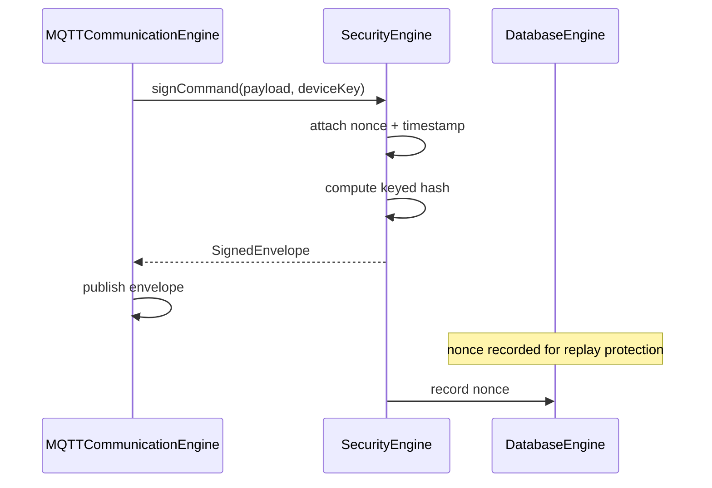
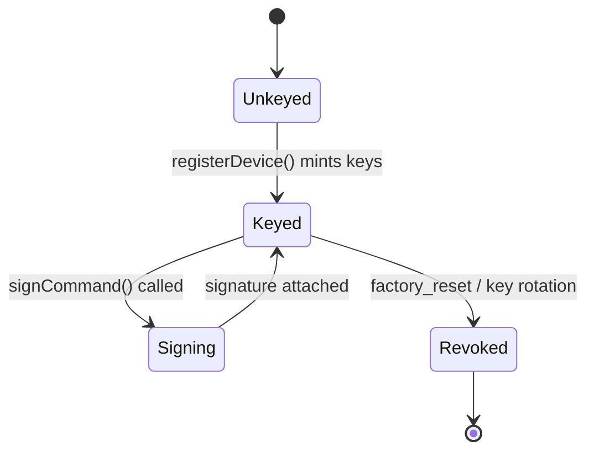

# Security Engine

## 1. Purpose

The Security Engine is the single place in the app that mints device keys,
signs outgoing commands, and verifies presented credentials. It exists so
that "how do we prove a command really came from an authorized phone" is
answered once, consistently, rather than re-implemented per feature.

**Status**: implemented, but scoped narrowly to MQTT
(`src/modules/mqtt/MQTTSecurity.ts`). This document specifies the
app-wide Security Engine that generalizes it — every engine that needs
signing or key verification (Bluetooth provisioning, future Automation
remote-trigger, etc.) should depend on this engine rather than reaching
into `MQTTSecurity` directly.

## 2. Responsibilities

- Generate device registration keys (owner/admin/registration) — delegated
  operationally to [Permission Engine](PermissionEngine.md), but the actual
  key-generation and hashing primitives live here.
- Sign outgoing device commands with a keyed hash plus nonce and timestamp,
  so a replayed or tampered command is detectable by the receiving device
  firmware.
- Verify presented plaintext keys against stored hashes (never storing
  plaintext keys at rest).
- Issue and validate replay-protection nonces per device.
- Provide the credential-handling primitives the
  [Bluetooth Engine](BluetoothEngine.md) needs during provisioning
  handshakes.

## 3. Features

- JWT-*shaped* device tokens (header.payload.signature structure) used for
  session-level identification between the phone and a device.
  ⚠️ These are **not** real JWTs verified by a standard library — they are
  a compatible-looking structure signed with the same keyed-hash scheme
  documented below, explicitly not interoperable with a generic JWT
  verifier. This is called out here, not hidden, per the project's honesty
  convention.
- Keyed-SHA256 command signing with nonce + timestamp
  (`signCommand`/`verifyCommand` in `MQTTSecurity.ts`).
  ⚠️ This is a **keyed hash, not HMAC** — it does not use HMAC's
  two-pass construction, so it should not be presented as HMAC-equivalent
  in security review. It is a deliberate placeholder for a real crypto
  library.
- Replay protection: each signed command carries a nonce; a nonce seen
  before within the replay window is rejected (`MQTTStorage`'s
  replay-nonce store).
- Key hashing (`hashKey`) so registration keys are never persisted in
  plaintext, only their hash.

## 4. Workflow

1. **Key generation**: on device registration
   ([Permission Engine](PermissionEngine.md) calls in), the Security
   Engine generates owner/admin/registration keys and returns plaintext
   once (for the caller to hand to the user via QR/pairing UI) while
   persisting only their hashes.
2. **Command signing**: before [MQTT Communication Engine](MQTTCommunicationEngine.md)
   publishes a command, it asks the Security Engine to sign the payload
   using the device's key (if known). The engine attaches a nonce and
   timestamp and computes the keyed hash over the full envelope.
3. **Command verification** (device-side concern, documented here for
   completeness of the contract): the device recomputes the same keyed
   hash and checks nonce freshness before acting on a command.
4. **Key verification**: when a plaintext key is presented (e.g. during a
   permission-elevation flow), the engine hashes it and compares against
   the stored hash — never compares plaintext directly.
5. **Token issuance**: on successful pairing/registration, a session token
   is issued for lighter-weight per-request identification without
   re-signing every message.

## 5. Internal Components

| Component | Responsibility |
|---|---|
| `KeyGenerator` | Produces owner/admin/registration keys |
| `KeyHasher` | One-way hash for at-rest key storage |
| `CommandSigner` | Keyed-hash signing + nonce/timestamp attachment |
| `ReplayGuard` | Tracks recently-used nonces per device, rejects reuse |
| `DeviceTokenIssuer` | Issues/validates JWT-shaped session tokens |

## 6. Public APIs

### `generateKey(prefix: string): Promise<string>`
Produces a new random key string tagged with a purpose prefix
(`"own"`/`"adm"`/`"reg"`).

### `hashKey(key: string): Promise<string>`
One-way hash for persistence/comparison.

### `signCommand(payload: Record<string, unknown>, deviceKey: string): Promise<SignedEnvelope>`
Attaches nonce + timestamp and computes the keyed-hash signature over the
envelope.

### `verifyCommand(envelope: SignedEnvelope, deviceKey: string): Promise<{ valid: boolean; reason?: string }>`
Recomputes the signature and checks nonce freshness; used in tests and by
any local verification path.

### `issueDeviceToken(deviceId: string, role: LumaRole): Promise<string>`
Issues a JWT-shaped session token (spec target — generalizes today's
per-command signing into a session-level credential).

## 7. Events

| Event | Payload | Emitted when |
|---|---|---|
| `KEY_GENERATED` | `{ deviceId, keyType }` | A new key is minted |
| `SIGNATURE_VERIFIED` | `{ deviceId }` | A verification succeeds |
| `SECURITY_VIOLATION` | `{ deviceId, reason }` | Signature mismatch, replayed nonce, or malformed envelope |

## 8. Database Schema

Via the [Database Engine](DatabaseEngine.md): a `device_keys` table
(deviceId, ownerKeyHash, adminKeyHash, registrationKeyHash, registeredAt) —
today this is `DeviceRegistryEntry` in `MQTTStorage.ts`'s AsyncStorage
`device_registry` key. A `used_nonces` table (deviceId, nonce, seenAt) with
a TTL-based cleanup for replay protection.

## 9. Local Storage

Current: AsyncStorage keys for the device registry (hashed keys only,
never plaintext) and the replay-nonce set, both via `MQTTStorage.ts`.

## 10. Communication Interfaces

- **Internal**: [Permission Engine](PermissionEngine.md) (key issuance
  during registration), [MQTT Communication Engine](MQTTCommunicationEngine.md)
  (command signing before publish), [Bluetooth Engine](BluetoothEngine.md)
  (provisioning credential handling), [Database Engine](DatabaseEngine.md)
  (persistence of hashes).
- **External**: none — all cryptographic material is generated and
  verified on-device; the backend never sees plaintext device keys.

## 11. Security

- Plaintext keys exist only transiently in memory during generation/
  presentation, never persisted (only hashes are stored) — this is the
  core invariant of this engine and must not regress.
- ⚠️ As noted in §3, the signing scheme is a keyed hash, not HMAC, and the
  device tokens are JWT-*shaped*, not standard JWTs. Any security review or
  production hardening pass should replace both with a vetted library
  (e.g. real HMAC-SHA256, real JWT with `jsonwebtoken`-equivalent) before
  this ships against real hardware with real attackers.
- Replay window is bounded — nonces are only remembered for a limited time,
  after which the same nonce would be accepted again; this is an accepted
  trade-off against unbounded storage growth, revisit if the threat model
  requires a longer window.

## 12. Error Handling

- `verifyCommand` failing → resolves `{ valid: false, reason }`, never
  throws, so a caller can decide to drop vs. alert vs. quarantine the
  device without a try/catch around every check.
- Missing device key at signing time → the command is still sent
  unsigned, but flagged, matching the existing project convention of never
  silently upgrading an unsigned command to look signed.

## 13. Recovery Strategy

- A device whose key was lost locally (app reinstall) requires falling
  back to the `registrationKey` flow rather than the `ownerKey`, since
  the owner key is not recoverable without the original plaintext.
- `SECURITY_VIOLATION` events feed the [Notification Engine](NotificationEngine.md)
  so a persistent signature-mismatch pattern (possible tampering or a
  desynced key) is surfaced to the user rather than silently retried
  forever.

## 14. Future Expansion

- Replace keyed-hash signing with real HMAC-SHA256 via a proper crypto
  library.
- Replace JWT-shaped tokens with standards-compliant JWTs, including
  expiry and refresh.
- Hardware-backed key storage (Keychain/Keystore) instead of AsyncStorage
  for the key hashes, once available in the target build type.

## 15. Integration Guide

Any engine that needs to prove authenticity of a message to a device:
1. Call `signCommand()` before handing the payload to the transport layer
   — never sign inside the transport engine itself, to keep this the one
   place signing logic lives.
2. Never persist a plaintext key anywhere outside a transient in-memory
   variable during generation/display.
3. Treat `SECURITY_VIOLATION` as a signal to alert, not to silently retry
   the same signature again.

## 16. Dependencies

[Database Engine](DatabaseEngine.md) (key/nonce persistence),
[Event Engine](EventEngine.md).

## 17. Sequence Diagram



## 18. State Diagram



## 19. Example API Usage

```ts
import { generateKey, hashKey, signCommand } from "@/modules/mqtt/MQTTSecurity";

const ownerKey = await generateKey("own");
const ownerKeyHash = await hashKey(ownerKey);

const envelope = await signCommand({ type: "toggle", value: true }, ownerKey);
// envelope: { payload, nonce, timestamp, signature }
```

## 20. Extension Registration Process

```ts
gateway.registerEngine(
  {
    id: "security_engine",
    name: "Security Engine",
    version: "1.0.0",
    capabilities: ["command-signing", "key-management", "replay-protection"],
    subscribedActions: ["SIGN_COMMAND", "VERIFY_COMMAND", "GENERATE_KEY"],
  },
  handleGatewayMessage,
);
```
