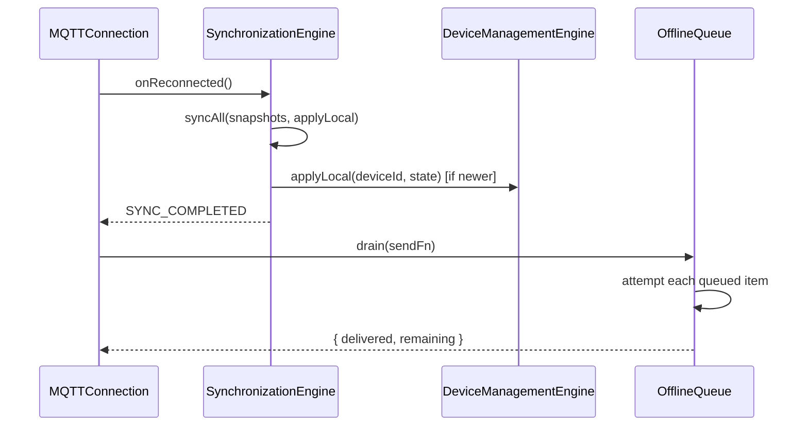
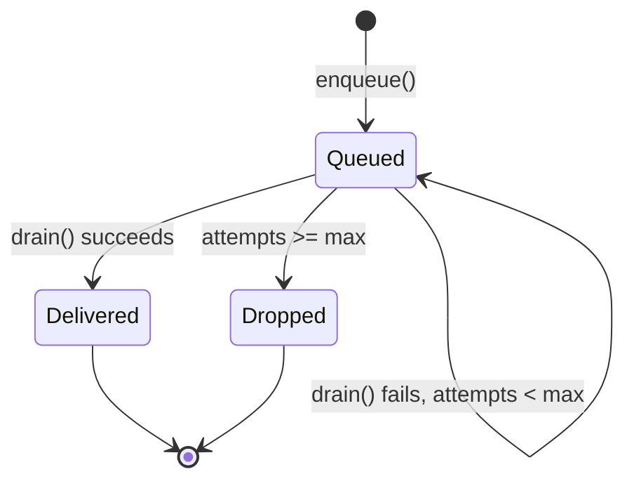

# Synchronization Engine

## 1. Purpose

The Synchronization Engine keeps the phone's local view of the world
consistent with reality across two axes: **offline command delivery**
(nothing the user asked for gets lost just because connectivity dropped)
and **state reconciliation** (a reconnect never lets stale local state
overwrite something newer, nor replays something that already happened).

**Status**: implemented, scoped to MQTT
(`src/modules/mqtt/MQTTQueue.ts` + `MQTTSync.ts`). This document specifies
the app-wide Synchronization Engine that other engines (Bluetooth mesh
store-and-forward, future Automation Engine remote triggers) should adopt
the same queue/version-check pattern from, rather than inventing their own.

## 2. Responsibilities

- Persist commands that couldn't be delivered on any channel, and drain
  them once connectivity returns, in order, with a bounded retry count.
- Reconcile local cached device state against freshly-arrived snapshots
  using a monotonically increasing per-device version number, so an
  out-of-order or duplicate delivery never regresses state.
- Sequence recovery correctly: sync-before-drain, so a queued command that
  already landed on the device while offline isn't blindly replayed on top
  of state that already reflects it.
- Surface "this command was permanently lost" to the user rather than
  swallowing it after retries are exhausted.

## 3. Features

- **Offline queue** (`MQTTQueue`): persisted, FIFO-per-item, max 8 delivery
  attempts before an item is dropped (with a visible terminal event, not a
  silent drop).
- **Version-checked reconciliation** (`MQTTSync`): a remote snapshot is
  only applied if its `version` is strictly newer than the cached value —
  the dedupe guard against replay and duplicate retained-message delivery.
- **Full resync pass** (`syncAll`) triggered right after a reconnect,
  before the offline queue drains, with `SYNC_STARTED`/`SYNC_COMPLETED`
  events bracketing it for UI feedback (e.g. a brief "syncing…" indicator).
- **Terminal-but-visible failure**: an item that exhausts retries emits a
  queued event with the drop reflected in state, so `MQTTQueue.size()`
  going down doesn't quietly imply success.

## 4. Workflow

1. **Enqueue**: any send path that exhausts every communication channel
   (see [MQTTCommunicationEngine.md](MQTTCommunicationEngine.md)'s failover
   chain) calls `enqueue(kind, deviceId, payload)`. The item is persisted
   immediately, not just held in memory.
2. **Reconnect trigger**: `ReconnectSupervisor.onReconnected`
   ([MQTTCommunicationEngine.md](MQTTCommunicationEngine.md) §13) fires
   `syncAll()` first.
3. **Reconciliation pass**: for each remote snapshot, `syncDevice()`
   compares versions; a stale/duplicate snapshot is skipped, a newer one is
   applied to local state and the cache is updated.
4. **Queue drain**: after sync completes, `drain(sendFn)` walks the
   persisted queue, attempting delivery of each item; successes are
   removed, failures increment their attempt counter and stay queued
   (unless they've hit the max).
5. **Terminal drop**: an item at `MAX_ATTEMPTS` is removed from the queue
   and logged as dropped — a UI surface (Notification Engine) is expected
   to tell the user their command didn't go through.

## 5. Internal Components

| Component | Responsibility |
|---|---|
| `OfflineQueue` (`MQTTQueue.ts`) | Persisted FIFO queue with bounded retries |
| `Reconciler` (`MQTTSync.ts`) | Version-checked snapshot application |
| Shared with [MQTTCommunicationEngine.md](MQTTCommunicationEngine.md)'s `ReconnectSupervisor` | Triggers the sync→drain sequence on reconnect |

## 6. Public APIs

### `enqueue(kind, deviceId, payload): Promise<QueuedOperation>`
Persists an undeliverable operation.

### `drain(sendFn: (op) => Promise<boolean>): Promise<{ delivered: number; remaining: number }>`
Attempts delivery of every queued item using the caller-supplied send
function; returns counts, never throws for individual item failures.

### `size(): Promise<number>` / `peekAll(): Promise<QueuedOperation[]>`
Introspection for a "pending commands" UI indicator.

### `syncDevice(snapshot: RemoteDeviceSnapshot, applyLocal: ApplyLocalFn): Promise<"applied" | "skipped_stale">`
Reconciles a single device's state against the cache.

### `syncAll(snapshots: RemoteDeviceSnapshot[], applyLocal: ApplyLocalFn): Promise<{ applied: number; skipped: number }>`
Full reconciliation pass, called once per reconnect.

## 7. Events

| Event | Payload | Emitted when |
|---|---|---|
| `COMMAND_QUEUED` | `QueuedOperation` | An item is enqueued (or dropped terminally — see §12) |
| `SYNC_STARTED` | `{ count: number }` | `syncAll()` begins |
| `SYNC_COMPLETED` | `{ applied: number, skipped: number }` | `syncAll()` finishes |

## 8. Database Schema

Via the [Database Engine](DatabaseEngine.md): `offline_queue` (id, kind,
deviceId, payload JSON, createdAt, attempts) and `device_cache` (deviceId,
version, updatedAt, state JSON) — today both are single AsyncStorage JSON
blobs (`MQTTStorage`'s `queue` and `deviceCache` keys).

## 9. Local Storage

Current: two AsyncStorage keys — the full offline-queue array and the full
device-state cache map — each read-modify-written as a whole blob per
operation.

## 10. Communication Interfaces

- **Internal**: [MQTT Communication Engine](MQTTCommunicationEngine.md)
  (queue producer/consumer, reconnect trigger),
  [Device Management Engine](DeviceManagementEngine.md) (`applyLocal`
  target for reconciled state), [Bluetooth Engine](BluetoothEngine.md)
  (should adopt the same queue pattern for mesh store-and-forward),
  [Notification Engine](NotificationEngine.md) (terminal-drop surfacing).
- **External**: none — synchronization is purely a local reconciliation
  concern between phone-cached state and device-reported state.

## 11. Security

- Queued payloads are not currently signed at enqueue time; signing
  happens at send time via the [Security Engine](SecurityEngine.md) when
  `drain()`'s `sendFn` actually attempts delivery, so a stale queued
  payload always gets a fresh nonce/timestamp rather than replaying an old
  signature.
- The device-state cache is not itself sensitive (device telemetry, not
  credentials), so no additional encryption-at-rest is applied beyond what
  the Database Engine provides generally.

## 12. Error Handling

- `sendFn` throwing during `drain()` → caught per-item, logged, treated as
  a failed attempt (attempt count increments) rather than aborting the
  whole drain pass.
- An item reaching `MAX_ATTEMPTS` (8) → removed from the queue; this is a
  deliberate "give up" rather than a bug — comment in `MQTTQueue.ts`
  explicitly calls out that this must never be a silent drop from the
  user's perspective.
- Empty queue → `drain()` short-circuits to `{ delivered: 0, remaining: 0 }`
  without touching storage.

## 13. Recovery Strategy

- Sync always runs before drain on every reconnect (see §4) — this
  ordering is load-bearing and must not be swapped, or a queued command
  could double-apply on top of state that already reflects it.
- Version comparison uses `>=` (not `>`) for staleness — an equal version
  is treated as already-applied, not as "apply again," to keep
  reconciliation idempotent under duplicate delivery.

## 14. Future Expansion

- Per-item priority in the offline queue (critical commands like
  `factory_reset` drained before routine brightness changes).
- Configurable `MAX_ATTEMPTS` and backoff between drain attempts, rather
  than draining the whole queue in one pass per reconnect.
- Extend the same queue/reconciliation pattern to non-MQTT channels
  (Bluetooth mesh, future backend-relayed commands) as first-class queue
  kinds instead of MQTT-specific ones.

## 15. Integration Guide

Any engine that can fail to deliver something important should reuse this
engine rather than building its own queue:
1. Call `enqueue()` with a `kind` describing the operation type, not a
   generic string — new kinds should be added to the `QueuedOperation`
   union explicitly.
2. On your engine's reconnect/recovery path, call `syncAll()` before
   `drain()`, in that order, every time.
3. Treat a `drain()` result's `remaining` count as "still pending," not as
   an error — only a terminal drop (visible via `COMMAND_QUEUED`'s
   accompanying drop log) is an actual failure to surface to the user.

## 16. Dependencies

[Database Engine](DatabaseEngine.md) (persistence),
[Security Engine](SecurityEngine.md) (fresh signing at drain time),
[Event Engine](EventEngine.md).

## 17. Sequence Diagram



## 18. State Diagram



## 19. Example API Usage

```ts
import { enqueue, drain } from "@/modules/mqtt/MQTTQueue";
import { syncAll } from "@/modules/mqtt/MQTTSync";

// On send failure across every channel
await enqueue("command", "L001", { type: "toggle", value: true });

// On reconnect
await syncAll(remoteSnapshots, (deviceId, state) => {
  mobileDeviceEngine.applyState(deviceId, state);
});
const { delivered, remaining } = await drain(async (op) => mqttManager.publishOp(op));
```

## 20. Extension Registration Process

```ts
gateway.registerEngine(
  {
    id: "sync_engine",
    name: "Synchronization Engine",
    version: "1.0.0",
    capabilities: ["offline-queue", "state-reconciliation"],
    subscribedActions: ["ENQUEUE_OPERATION", "SYNC_ALL", "DRAIN_QUEUE"],
  },
  handleGatewayMessage,
);
```
